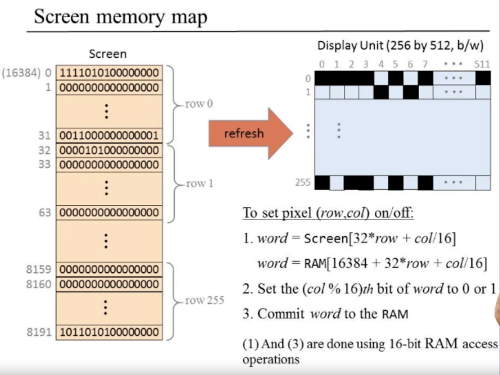
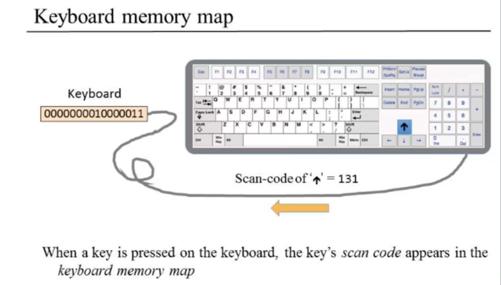
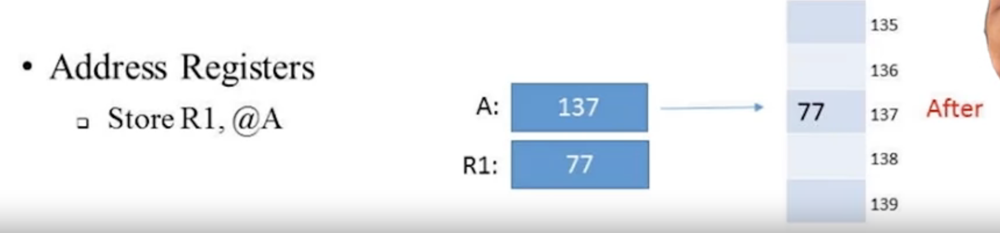
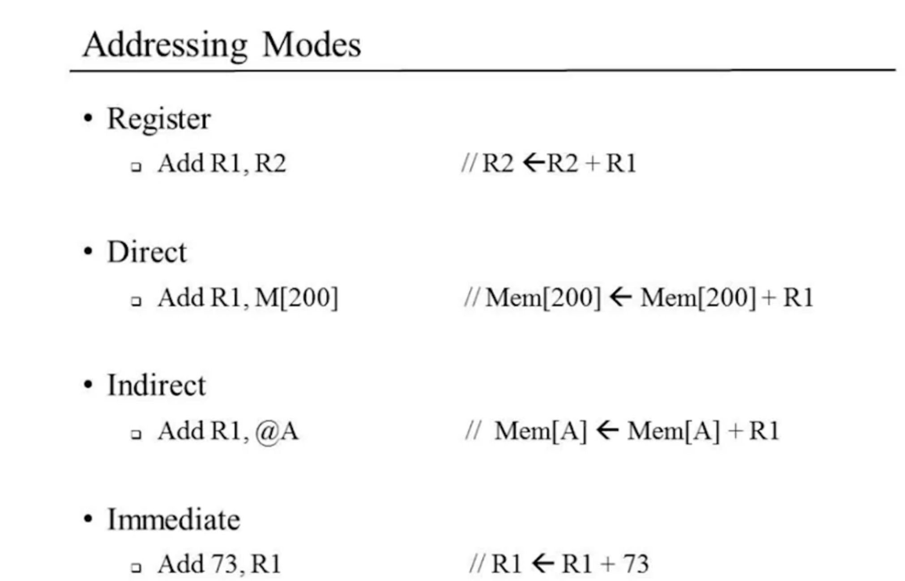
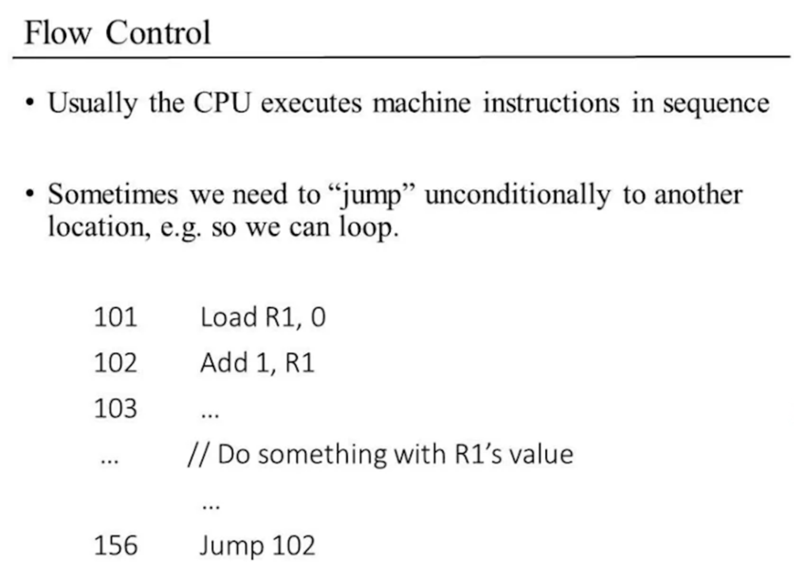
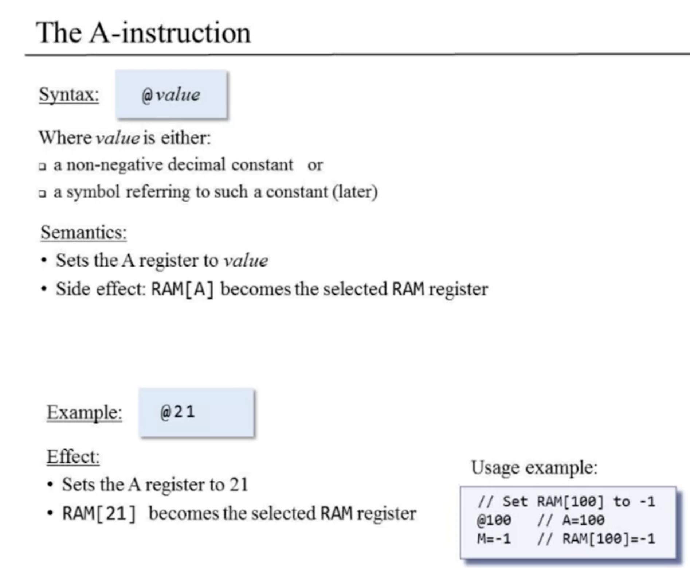
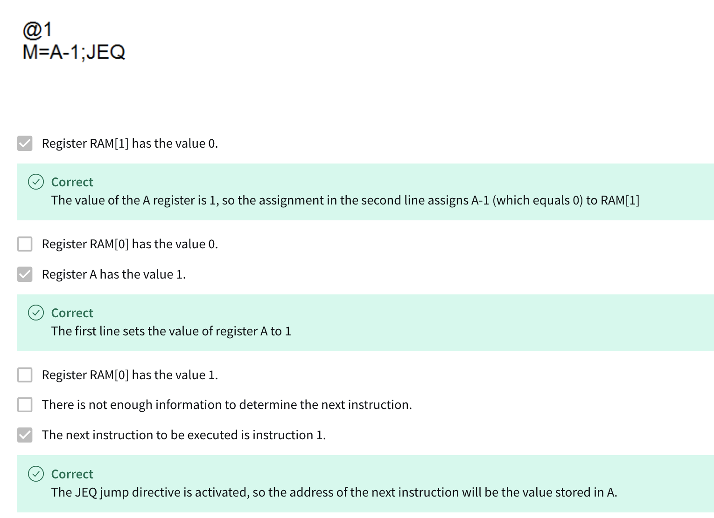
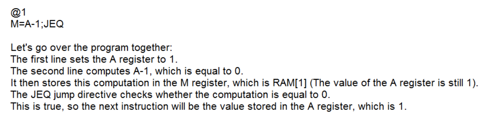
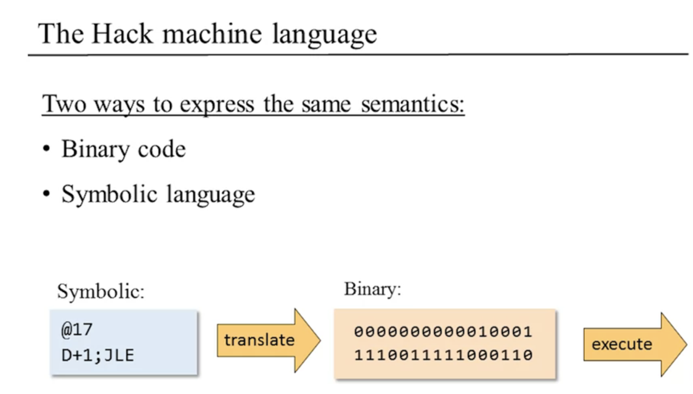
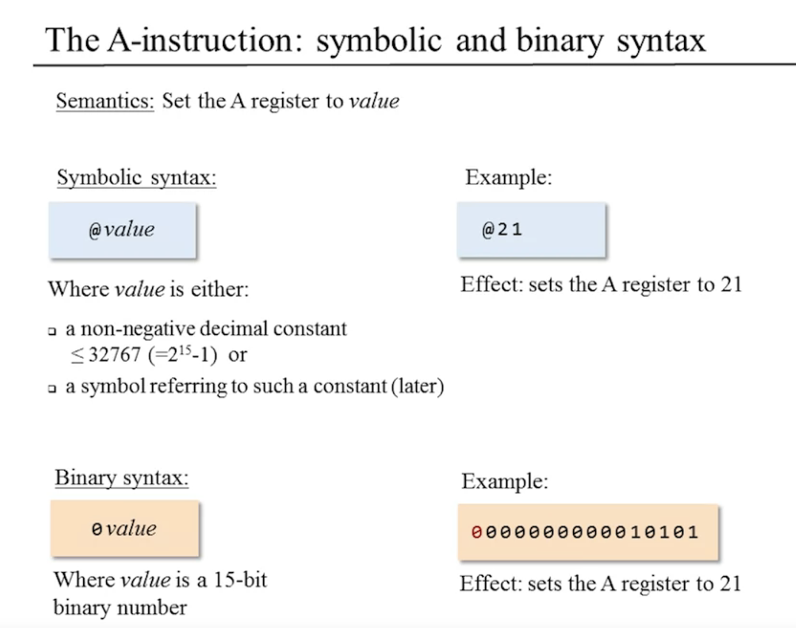

# From Nand To Tetris

## Project4 - Machine Language	

취지 

- 기계어로 직접 프로그램을 작성할 일은 흔치 않지만, 컴퓨터의 작동 원리를 완전히 이해하려면 저수준 프로그래밍을 공부하는 것이 필수다

- 가장 정교한 소프트웨어 시스템이라도 그 밑바닥은 단순한 비트 단위 하드웨어 연산 명령어들로 이루어진다는 사실을 직접 관찰해 보는 일은 대단히 흥미로운 경험이다.

#### Cheat sheet

- 이 장에서는 기계보다는 그 기계를 제어하는 언어에 대하여 중점을 둔다.	

- “형태는 기능을 따른다”라는 말처럼 어떠한 시스템을 구축하거나 이해하기 위해선 기능을 먼저 파악해야 한다. 모든 범용 컴퓨터의 궁극적인 기능은 기계어machine language로 작성된 프로그램을 효율적으로 실행하는 것이다. 	

- 고수준 언어의 목적이 플랫폼 간의 유연성과 강력한 표현력이라면, 기계어의 목적은 대상 하드웨어 플랫폼에서 직접적으로 명령을 실행하고 하드웨어를 제어하는 것이다.

- 기계어는 프로세서(CPU)와 레지스터들을 이용하여 메모리를 조작하도록 설계된 언어라고 할 수 있다. 

- 하드웨어 구성요소

  - 메모리: 데이터(Data)와 명령어(Instruction)를 저장, 고유한 주소를 갖는 연속적인 배열
  - 프로세서: 선택한 레지스터나 메모리 위치에서 입력을 가져와, 역시 선택된 레지스터나 메모리 위치에 출력을 기록

  - 레지스터

    - 프로세서와 메모리는 별개의 칩으로, 두 칩 사이에서 데이터를 옮기는 것은 상대적으로 느린 작업이다. 따라서 프로세서는 내부에 레지스터들(`R0`, `R1`, `R2`, ...)을 두고 있으며, 이들은 데이터와 명령어를 빠르게 처리하는 고속 로컬 메모리 역할을 한다.

    - CPU 내에 위치한 레지스터는 두 종류로 나눌 수 있다. 1) **Data register**: 데이터를 저장, 2) **Address register**(`A`): 데이터나 주소로 해석되는 값을 저장하고, 이 값에 해당하는 주소의 메모리를 선택한다. 이처럼 `A` 레지스터가 선택한 주소의 메모리 레지스터를 `M`으로 나타낸다.

    ```assembly
    # 메모리 위치 17에 값 1를 저장한다
    load A, 17 # A = 17
    load M, 1 # M: A가 선택한 메모리 레지스터(즉, A의 현재 값인 17이 주소인 메모리 레지스터)
    ```

- Machine language program은 binary와 symbolic 두 가지 버전으로 작성될 수 있다. 기호 기계어(후자)를 어셈블리어(assembly language)라고 부르며, 그 언어를 2진 코드로 번역하는 프로그램을 어셈블러(assembler)라고 부른다.
  - 어셈블러가 탄생한 아이디어: ‘R1 + R2의 값을 R1에 설정하라’, 이것을 2진 코드로 표현하는 것보다 `R`, `1`, `2`, `+` 같은 기호들도 미리 약속된 2진 코드로 표현할 수 있다는 생각에 도달하기까지는 그리 오래 걸리지 않았다. 기호 명령어로 프로그램을 작성하고, 그 기호 명령어를 실행 가능한 2진 코드로 번역하는 번역기 프로그램을 사용하면 어떨까?
  - reloctable code: 기호 참조는 단순한 꾸밈 요소로서가 아니라, 코드가 불필요하게 물리적 메모리 주소와 얽히지 않도록 만들어 주는 용도로 쓰인다고 볼 수 있다.

- 폰노이만 구조? 현대 범용 컴퓨터들이 따르는 모델로, CPU, 메모리, 프로그램 등으로 구성된다.

- 16비트 컴퓨터라는 말은 CPU와 메모리가 16비트 값들을 처리하고 이동하고 저장하도록 설계되었다는 뜻이다.

- 핵 플랫폼은 데이터 메모리data memory와 명령어 메모리instruction memory라는 두 개의 개별 메모리를 활용한다.

  

  - 데이터 메모리(RAM이라고도 함)는 읽고 쓰기가 가능한 장치이다. 핵 명령어는 선택된 RAM 레지스터에서 데이터를 읽거나 쓰도록 명령할 수 있다.
  - 명령어 메모리(ROM이라고도 함)는 읽기 전용 장치로, 프로그램은 어떤 외부 수단으로 메모리에 로드된다.

- 핵 명령어는 3개의 16비트 레지스터, 즉 데이터 레지스터(D), 주소 레지스터(A), 선택된 데이터 메모리 레지스터(M)를 조작하도록 설계되어 있다.

  - `D`: 16비트 값을 저장
  - `A`: 주소 레지스터 또는 데이터 레지스터의 두 가지 역할, 
    - 값 17을 `A` 레지스터에 저장하고 싶다면, `@17`이라는 핵 명령어를 쓰면 된다.	

- 핵 명령어 @xxx는 A 레지스터에 값 xxx를 설정한다. 또한 @xxx 명령어에는 추가적인 기능이 두 가지 더 있다. 첫 번째는 주소가 xxx인 RAM 레지스터를, 선택된 메모리 레지스터 M으로 만드는 것이다. 두 번째는 주소가 xxx인 ROM 레지스터의 값을 선택된 명령어가 되게 한다.

  - `@29`: A register에 29를 load한다. 그리고 M register는 RAM[29]를 참조한다.

    ```assembly
    @29 	# A register = 29, 그리고 M register는 RAM[29]를 가리킴
    M=D 	# RAM[29]에 D register의 값을 저장
    ```

  - RAM[100]의 값을 17로 설정

    ```assembly
    @17
    D=A
    @100
    M=D
    ```

  - 점프 명령어와 함께 사용될 때 A register의 값은 다음에 실행할 ROM 주소를 지정

    ```assembly
    @END	 # A = END의 주소값
    0; JMP;	 # ROM[END]로 점프
    ```

    - `if D==0 goto 52`라는 논리는 `@52` 다음에 `D;JEQ`라는 명령어로 구현할 수 있다.

- 즉 `@xxx` 명령어의 역할
  1. A register의 값 설정
  2. RAM 접근을 위한 M 선택
  3. ROM 명령어 선택


##### 간단한 연습문제들

1. `D = 17`

   ```assembly
   @17
   D = A
   ```

2. `RAM[100] = 17`

   ```assembly
   @17	 	# A=17
   D = A
   @100 	# M = RAM[100]
   M = D
   ```

3. `RAM[100] = RAM[200]`

   ```assembly
   @200
   D = M
   @100
   M = D
   ```

4. `goto 29`

   ```assembly
   @29
   0;JMP	# if D == 0; goto 29
   ```

5. `if D > 0 goto 63`

   ```assembly
   @63
   0; JGT
   ```

6. `x = -1`

   ```assembly
   @x
   M = -1
   ```

7. `count = count - 1`

   ```assembly
   @count
   M = M - 1
   ```

8. `sum = sum + x`

   ```assembly
   @sum
   D = M
   @x
   D = D + M
   @sum
   M = D
   ```


- A-명령어: A-명령어는 A 레지스터에 15비트 값을 설정한다. 

  - 예를 들어 `@5`라는 기호 명령어는 2진 버전이 `0000000000000101`이고, 5의 2진수 코드를 A 레지스터에 저장한다.
  - 컴퓨터에 상수를 입력
  - 선택된 RAM 레지스터의 주소(M으로 참조됨)를 A에 설정
  - A에 점프 목적지 주소를 설정

- C-명령어: 무엇을 계산할지(comp로 표시되는 ALU 연산), 어디에 계산된 값을 저장할지(dest), 그리고 다음에 무엇을 할지(jump)라는 세 가지 질문에 답한다.

- `SCREEN`, `KBD`: 

  - 스크린과 키보드는 각각 메모리 맵memory map이라는 미리 지정된 메모리 블록 두 개를 인터페이스로 컴퓨터와 통신한다.

  - SCREEN과 KBD 기호는 각각 16384(0x4000)와 24576이라는 값에 바인딩, 이 값은 각 메모리 맵의 시작 주소

  - **스크린에 픽셀 그리기**: 

    

    - 스크린용으로 지정된 메모리 세그먼트에 2진수 값을 쓰는 방식으로 이루어진다. (512 x 256), 16-bit word 8K개 메모리 블록에 저장된 메모리 맵으로 표시되며, RAM 시작 주소는 선언 기호 `SCREEN`으로도 참조. 
    - **위에서 row 번째 행, 왼쪽에서 col 번째 열은 `RAM[SCREEN + row  32 + col/16]`에 위치한 워드의 (LSB에서 MSB 방향으로 보았을 때) col % 16번째 비트로 매핑된다.**

  - **키보드 읽기**: 

    

    - RAM 주소 24576(16진수로 6000)에 위치한 1word 크기 메모리 맵을 통해 물리적 키보드 장치와 통신하며, RAM 시작 주소는 선언 기호 `KBD`로도 참조한다. 
    - 눌린 키의 16비트 코드가 RAM[KBD]에 기록된다.

- 레이블 기호: `LOOP`, `END`, `STOP`


---


---

##### Memory Hierarchy

CPU의 처리 속도에 비해 memory에 location에 대한 accessing은 long takes time이 소요된다.

이에 대한 solution으로, CPU에 인접한 registers 및 cache를 두는  memory hierarchy를 따른다.


---

##### Registers - data registers, address registers







---


---




---




---





---







---


