# From Nand To Tetris

## Project5 - Computer Architecture

- **핵 플랫폼은 핵 기계어로 작성된 프로그램을 실행할 수 있는 16-bit 폰 노이만 기계이다. CPU, 명령어 메모리와 데이터 메모리로 구분되는 두 개의 독립된 메모리 모듈, 그리고 두 개의 메모리 매핑 I/O 장치(스크린, 키보드)로 구성된다.**

- 내장식 프로그램(Stored program)의 아이디어: 프로그램들이 하드웨어에 내장되지 않는다. 그 대신 프로그램의 코드가 컴퓨터 메모리에 데이터처럼 저장되어서 우리가 소프트웨어라 부르는 대상이 된다. 현재 실행하는 소프트웨어에 따라 사용자가 경험하는 컴퓨터 동작이 다르기 때문에, 동일한 하드웨어 플랫폼이라도 다른 프로그램을 불러오면 전혀 다른 일을 수행할 수 있다.

- 폰 노이만 구조: 폰 노이만 구조는 메모리 장치와 통신하고, 입력 장치에서 데이터를 받고, 출력 장치로 데이터를 내보내는 중앙 처리 장치Central Processing Unit, CPU를 바탕으로 한다(그림 5.1). 내장식 프로그램 개념은 이 구조의 핵심으로, 컴퓨터가 조작하는 데이터 외에 컴퓨터가 수행할 작업을 지시하는 명령어도 메모리에 저장된다는 개념이다.

  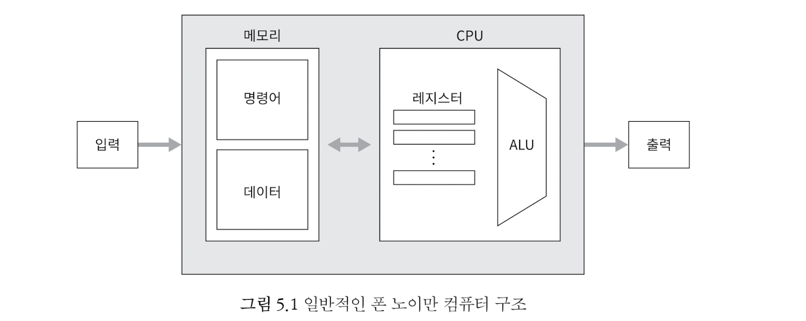

### 메모리

: 데이터와 프로그램을 저장

- **물리적으로** 메모리는 주소를 지정할 수 있는 고정된 크기의 레지스터들을 선형적으로 배열한 것으로, 이 레지스터들은 고유 주소와 값을 가진다.

- **논리적으로** 이 주소 공간은 데이터 저장과 명령어 저장이라는 두 가지 용도로 사용된다. 명령어 워드instruction word와 데이터 워드data word는 둘 다 정확히 똑같은 방식으로 구현된다. 즉, 비트 열로 표현된다(as sequences of bits.).

- 특정 메모리 레지스터에 접근하려면 레지스터 주소가 필요하다. 주소 지정**addressing**이라고도 불리는 이 작업을 통해 레지스터 데이터에 직접 접근할 수 있다.

- 임의 접근 메모리**Random Access Memory, RAM**라는 용어는, 메모리 크기나 레지스터 위치와 관계없이 무작위로 선택된 메모리 레지스터에 즉시, 즉 동일 주기(또는 시간 단위) 내에 접근할 수 있어야 한다는 뜻에서 나온 말, 확실히 레지스터가 수십억 개에 달하는 메모리 장치에서는 이 능력이 중요하다.

- **종류** - 데이터와 명령어를 별도의 메모리에 저장하기 위함.

  - 데이터(Data) 메모리: 데이터 전용 메모리 영역, 고수준 프로그램의 추상적인 배열 처리나 객체에서 get/set 연산은 선택된 메모리 레지스터를 읽고 쓰는 일로 환산된다(주어진 주소의 레지스터의 값을 조사하거나 새로운 값을 덮어씀). 

    - 16-bit, 32K RAM, 읽기/쓰기 가능, 즉, 읽고 쓰기가 가능한 32K개의 16-bit register로 구성된다.
    - 데이터 메모리는 컴퓨터의 범용 데이터 저장소 역할을 할 뿐만 아니라, CPU와 컴퓨터의 입출력 장치 사이의 인터페이스 역할도 수행 

    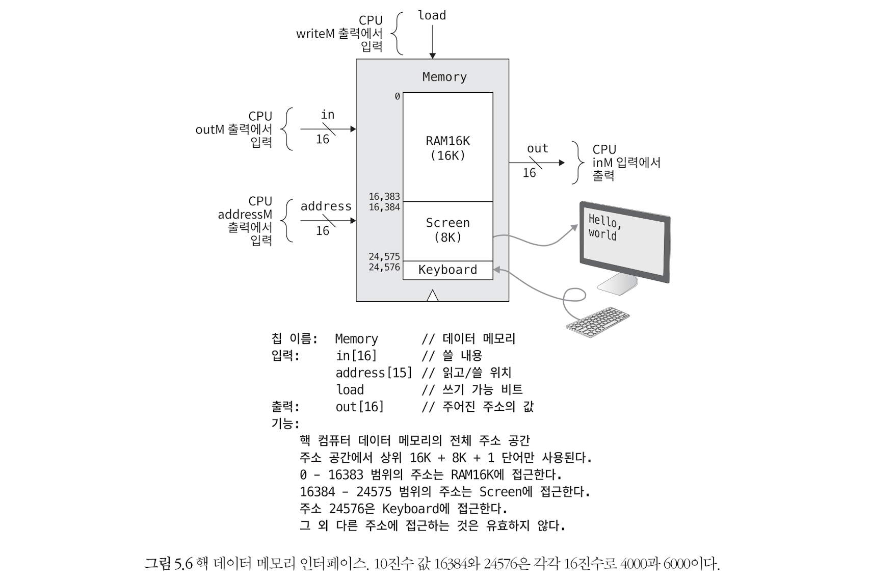

  - 명령어(Instruction) 메모리(`ROM32K`): 명령어 전용 메모리 영역, 프로그램을 실행하려면 먼저 대용량 저장 장치에서 2진 버전 프로그램을 불러온 후에 그 명령어를 컴퓨터의 명령어 메모리에 직렬화해야 한다.

    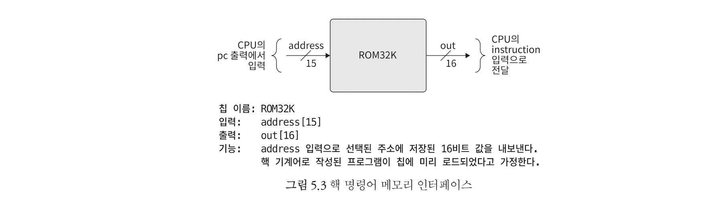

    - 핵 컴퓨터는 명령어 메모리에 올라온 프로그램을 실행한다. 명령어 메모리는 프로그램이 미리 로드된 ROM(읽기 전용 메모리) 칩으로 구현하였다.

### CPU(중앙 처리 장치, Central Processing Unit)

: 현재 실행 중인 프로그램의 명령어를 실행한다. 세 가지 주요 요소(ALU, Set of registers, Control unit)를 활용한다.

- **핵 CPU는 Project2에서 만든 ALU와 세 종류의 registers(data(D), address(A), PC)로 구성된다.**

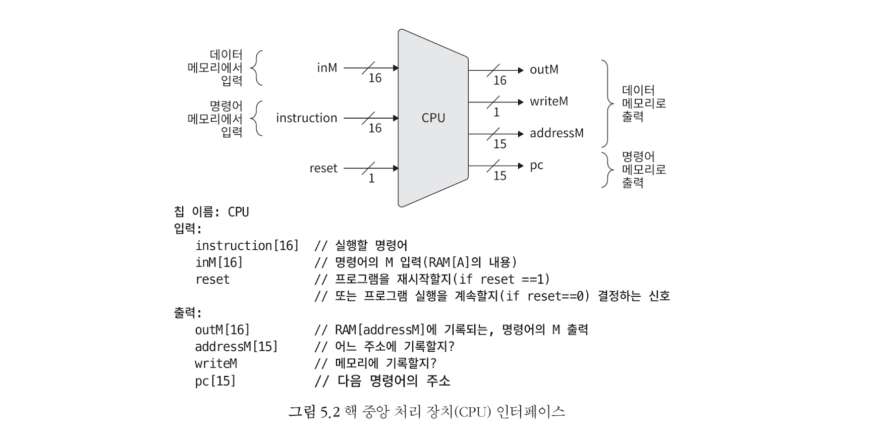

- ALU: 산술 연산 및 논리 연산
- Registers: CPU 내부의 임시 저장 장치
  - 속도가 빠른 프로세서(CPU)가 입출력이 느린 데이터 저장소(RAM)에 영향을 받아 속도가 느려지는 상태를 기아 상태starvation라 한다.

  - 기아 상태를 방지하고 성능을 향상시키기 위해 일반적으로 CPU에는 프로세서에서 곧바로 접근 가능한 메모리 역할을 하는 (비교적 비싼) 고속 레지스터들을 작은 용량으로 탑재한다.
  - 종류 - D 레지스터가 오직 데이터 값 저장에만 사용되는 반면, A 레지스터는 사용되는 문맥에 따라 세 가지 다른 목적(데이터 값 저장(D 레지스터처럼), 명령어 메모리의 주소 선택, 데이터 메모리의 주소 선택)으로 사용됩니다.
    - Data register(`D`): 데이터 값 저장
    - Address register(`A`): 데이터 값 저장, 명령어 메모리의 주소 선택, 데이터 메모리의 주소 선택
    - Program counter(`PC`): fetch해야 할 명령어의 주소를 저장
    - Instruction register: 현재 명령어를 저장

- Control: 

  > 컴퓨터의 명령어는 다음 단계를 따른다.
  >
  > 1) 디코딩(Decoding) - 명령어는 마이크로 코드들로 구조화된 패키지이므로, 명령어를 마이크로 코드로 디코드 한다.
  > 2) 라우팅(Routing) - 각 마이크로 코드를 ALU, registers, memory 등에 전달한다.
  > 3) 실행(Excution)

- Fetch-Excute: 각 단계(주기)마다 CPU는 명령어(instruction) 메모리에서 2진 기계 명령어를 인출하고, 디코딩하고, 실행한다.

### 입력과 출력

- 컴퓨터 과학자들은 다양한 I/O 장치들의 복잡성을 추상화해서 여러 입출력 장치들을 컴퓨터에서 완전히 똑같이 보이도록 만드는 기법들을 고안하였다. 이 추상화 기법의 핵심이 바로 메모리 매핑 I/O이다.

- 메모리 매핑 I/O의 기본 아이디어: I/O 장치 마다 컴퓨터 메모리에 지정된 영역(메모리 맵)을 할당하여, I/O 장치를 일반 선형 메모리 세그먼트처럼 보이게 한다. 예를 들어, 키보드를 입력한 경우(물리적 상태) 해당 이진 코드가 메모리 맵에 실시간 반영된다. 

- 스크린(`SCREEN`): 16-bit, `8K RAM`, 256 * 512z

  - 스크린에 이미지를 그리는 것은 스크린 메모리 맵이라고 불리는 지정된 메모리 세그먼트에 16비트 값을 쓰는 것으로 가능

  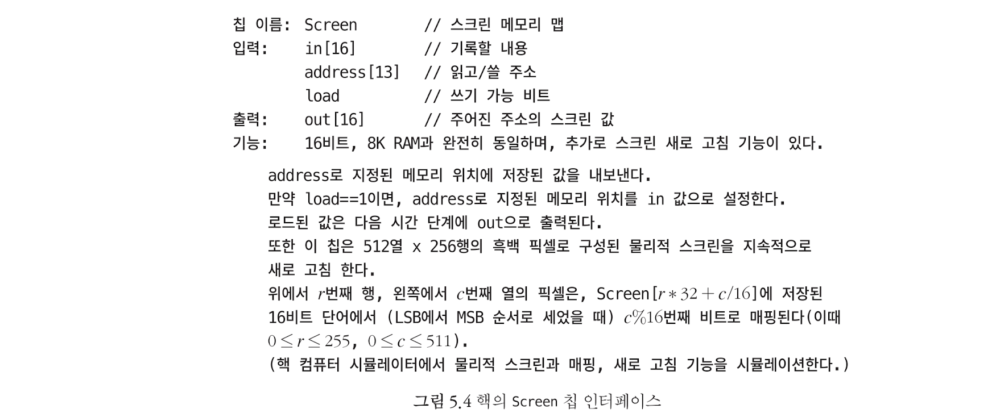

- 키보드(`KBD`)

  - 현재 키보드에서 어떤 키가 눌렸는지는 키보드 메모리 맵이라고 불리는 지정된 16비트 메모리 레지스터를 확인함으로써 알 수 있음

  

- => 모든 I/O 장치를 메모리처럼 다룰 수 있게 되어, 단순한 메모리 조작만으로 I/O 장치의 제어가 가능해진다. 

- 주요 특징

  - 데이터 직렬화: 다차원 데이터(예: 스크린의 2차원 픽셀)를 1차원 메모리 구조에 매핑하기 위하여

  - 실시간 동기화: 초당 여러 번 갱신되어 사용자에게 즉각적인 반응으로 보임

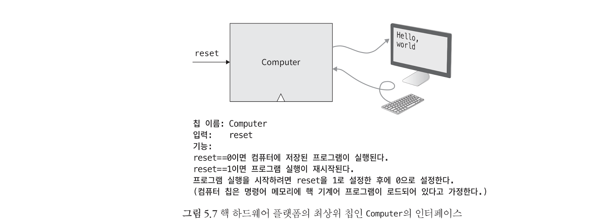

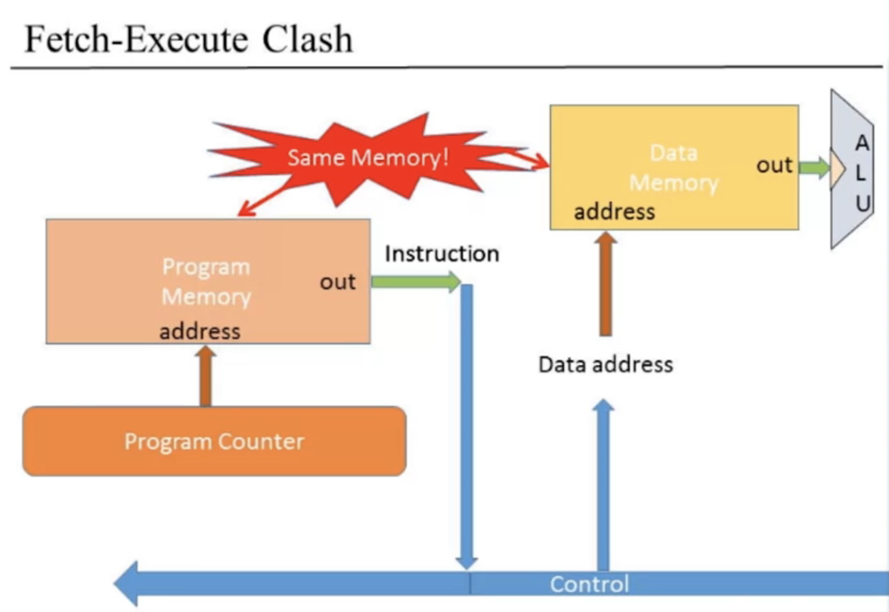

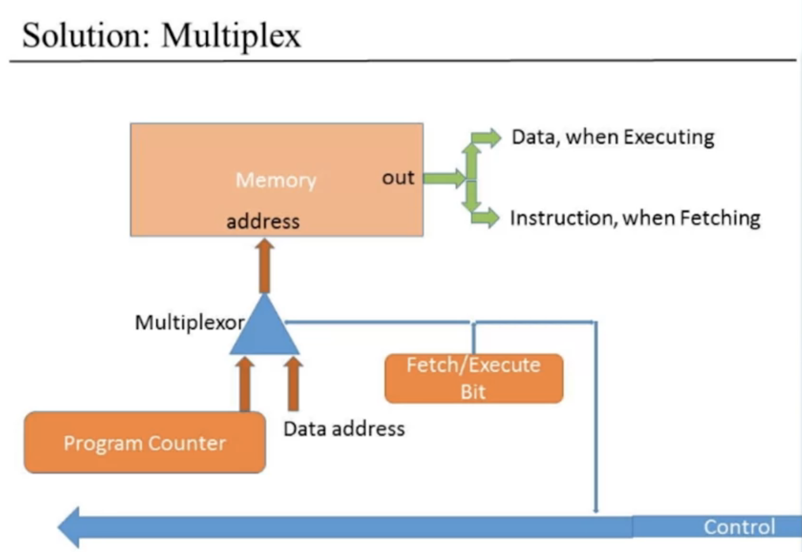

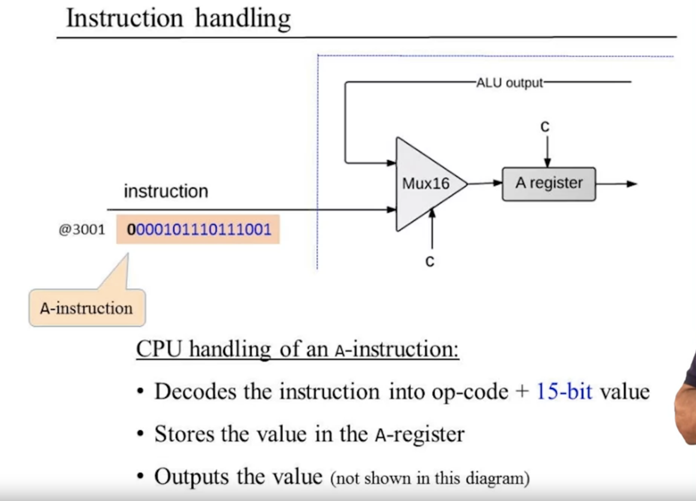

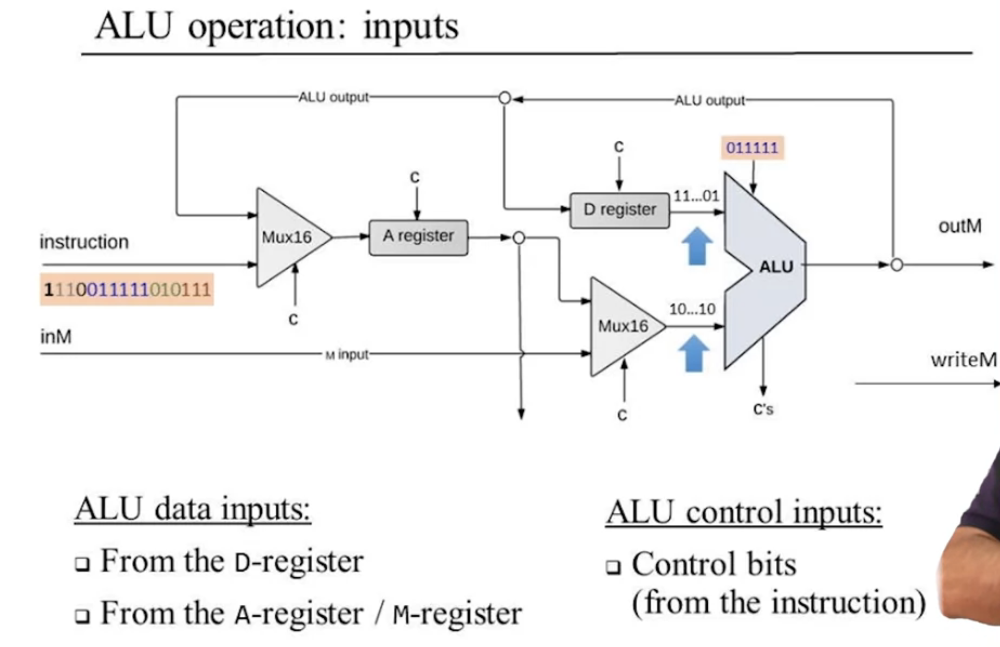

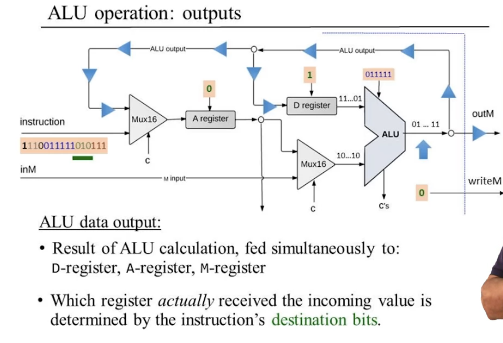

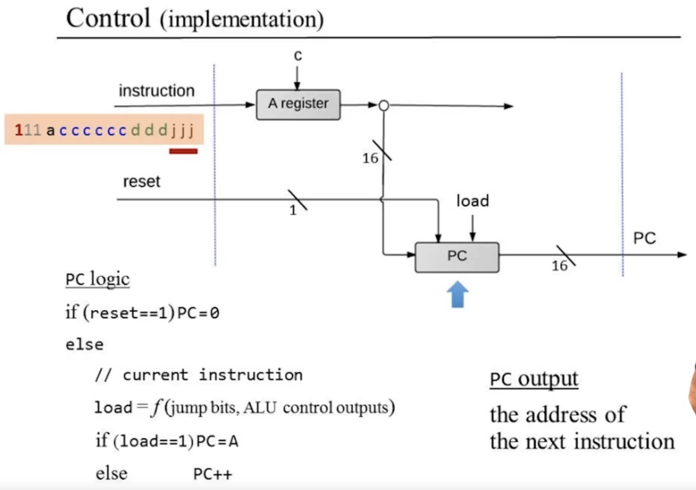

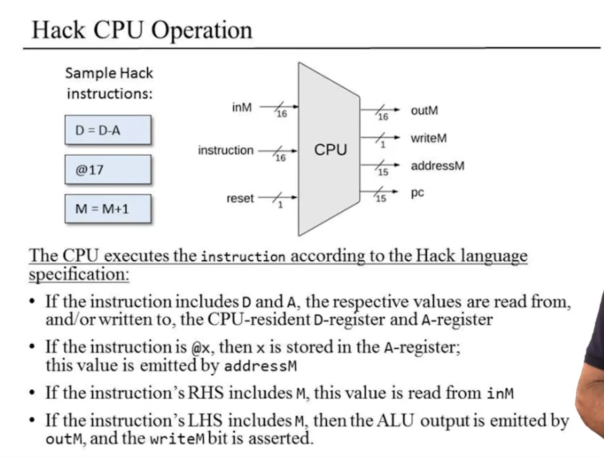

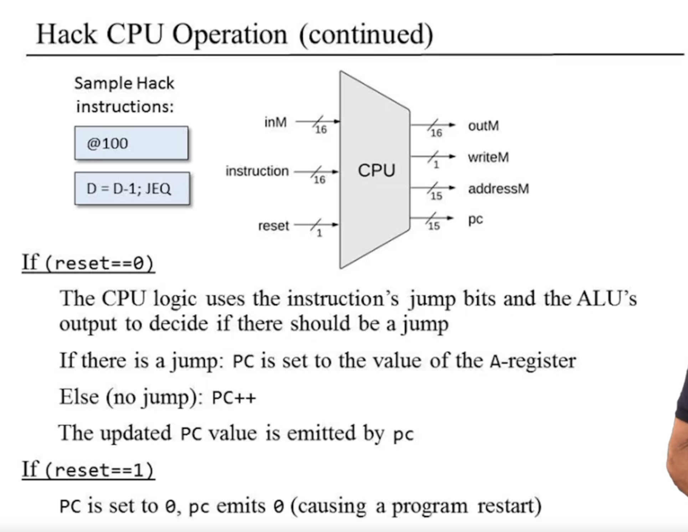

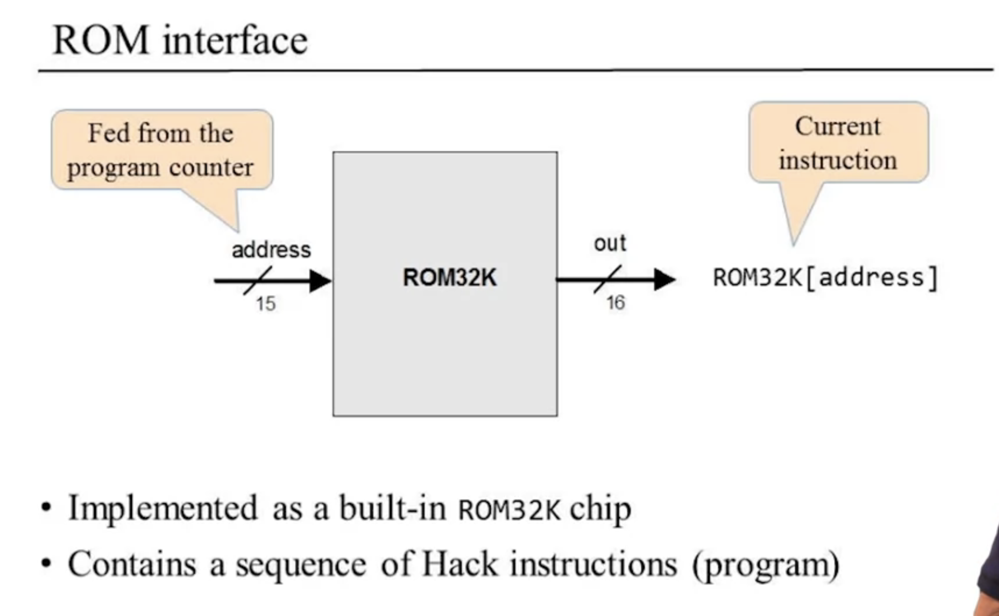

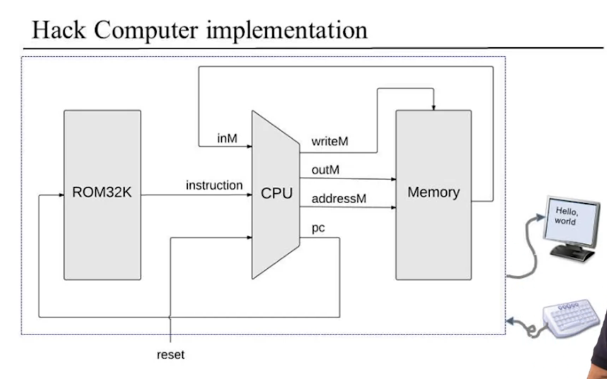