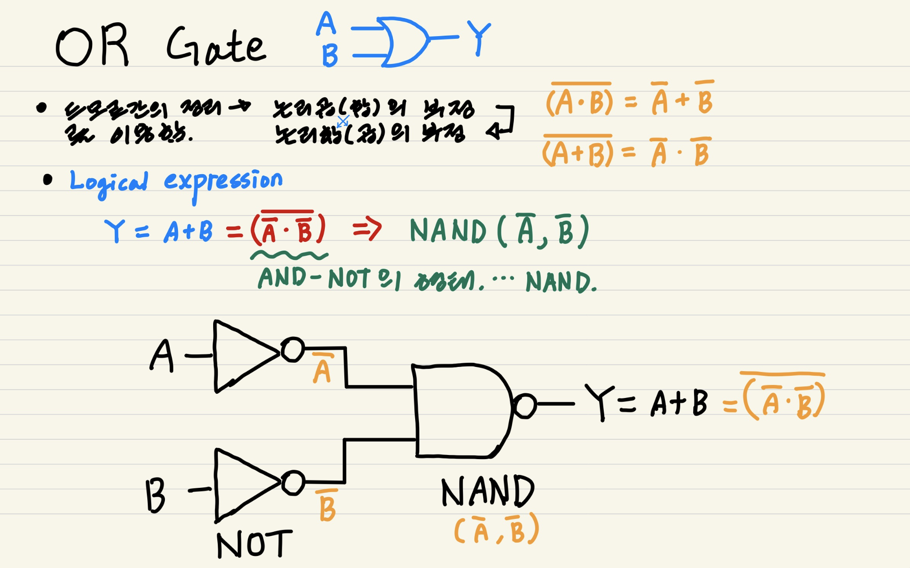
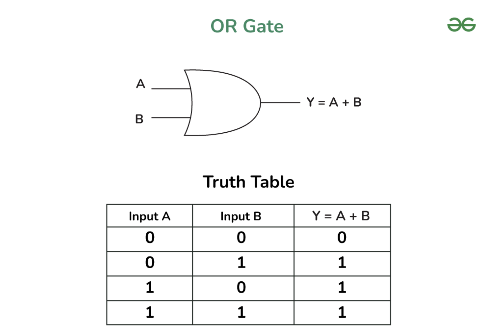
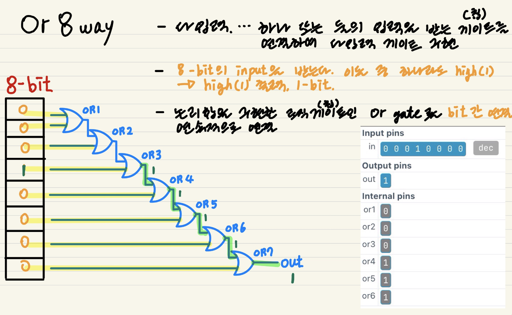
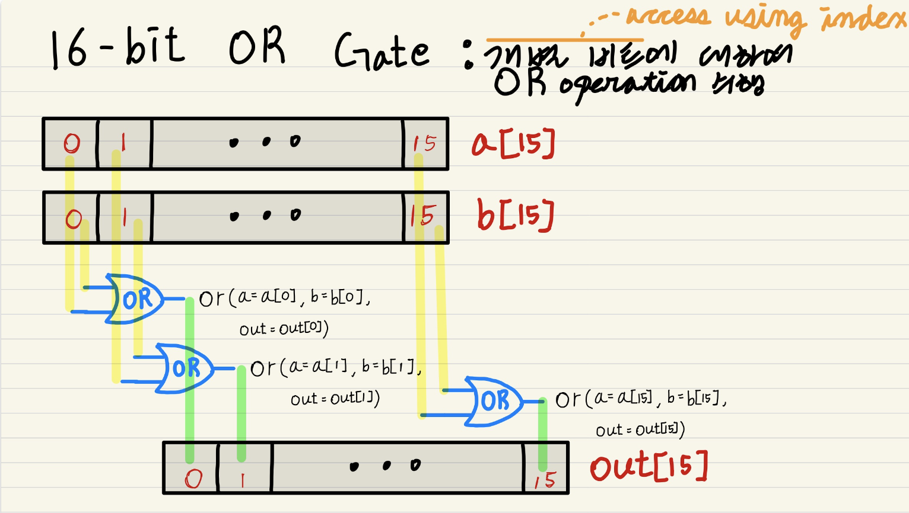
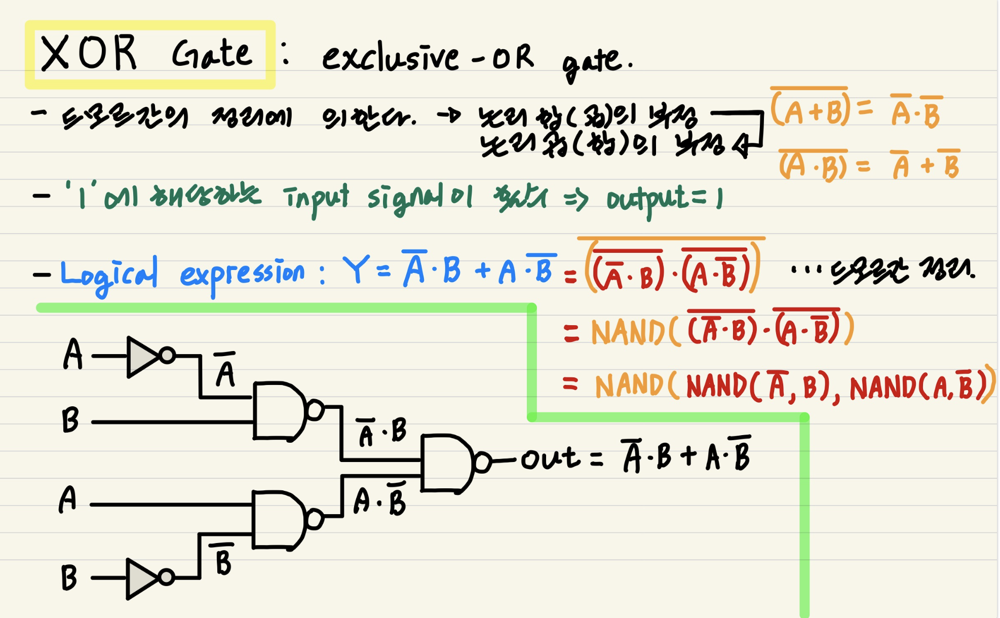
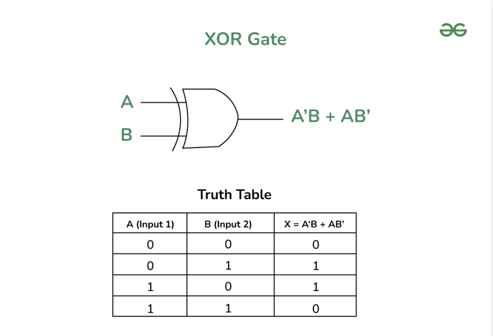

# From Nand To Tetris

## Project1 - Boolean Logic

### 1. Implementation of OR Gate from NAND Gate

**About OR Gate**

- **Why?** logical disjunction( 논리합, ∨)을 구현하기 위함이다.

  - Boolean expression of OR gate: `𝑋+𝑌=𝑍`

- **What?** 두 input signal 중 하나라도 high(`1`)라면, high(`1`)를 출력한다.

  - Interface 

- **How?** 드모르간의 정리(`(A ∪ B)' = A' ∩ B'`)를 이용한다. NAND과 NOT Gate를 이용한다.

  - ~~~shell
    # * Or gate:
    # * if (a or b) out = 1, else out = 0 
    CHIP Or {
        IN a, b;
        OUT out;
    
        PARTS:
        # Nand(a=a, b=a, out=aout);
        # Nand(a=b, b=b, out=bout);
        Not(in=a, out=aout);
        Not(in=b, out=bout);
        Nand(a=aout, b=bout, out=out);
    }
    ~~~

---

### 2. Implementation of OR8Way from NAND Gate

**About OR16 Gate**

- **Why?** 여러 소스에서 발생한 인터럽트를 하나의 신호로 통할 때 활용할 수 있다.

- **What?** 8-bit의 input(`in[8]`)을 받았을 때, `index 0..7` 중 하나라도 1이 있다면 1을 출력한다(`out[1]`).

- **How?** OR Gate 7개를 연쇄적으로 잇는다.

  - ~~~shell
    # * 8-way Or gate: 
    # * out = in[0] Or in[1] Or ... Or in[7]
    CHIP Or8Way {
        IN in[8];
        OUT out;
    
        PARTS:
        Or(a=in[0], b=in[1], out=or1);
        Or(a=or1, b=in[2], out=or2);
        Or(a=or2, b=in[3], out=or3);
        Or(a=or3, b=in[4], out=or4);
        Or(a=or4, b=in[5], out=or5);
        Or(a=or5, b=in[6], out=or6);
        Or(a=or6, b=in[7], out=out);
    }
    ~~~

---

### 3. Implementation of OR16 from NAND Gate

**About OR16 Gate**

- **Why?**

- **What?** 16-bit input(`a[16]`, `b[16]`)이 주어졌을 때, 개별 비트에 대하여 OR operation을 수행한다(`out[16]`).

- **How?** `a`와 `b`의 개별 비트 `[0..15]`에 대하여 OR Gate를 통과한다.

  - ~~~shell
    # * 16-bit Or gate:
    # * for i = 0, ..., 15:
    # * out[i] = a[i] Or b[i] 
    CHIP Or16 {
        IN a[16], b[16];
        OUT out[16];
    
        PARTS:
        Or(a=a[0], b=b[0], out=out[0]);
        Or(a=a[1], b=b[1], out=out[1]);
        Or(a=a[2], b=b[2], out=out[2]);
        Or(a=a[3], b=b[3], out=out[3]);
        Or(a=a[4], b=b[4], out=out[4]);
        Or(a=a[5], b=b[5], out=out[5]);
        Or(a=a[6], b=b[6], out=out[6]);
        Or(a=a[7], b=b[7], out=out[7]);
        Or(a=a[8], b=b[8], out=out[8]);
        Or(a=a[9], b=b[9], out=out[9]);
        Or(a=a[10], b=b[10], out=out[10]);
        Or(a=a[11], b=b[11], out=out[11]);
        Or(a=a[12], b=b[12], out=out[12]);
        Or(a=a[13], b=b[13], out=out[13]);
        Or(a=a[14], b=b[14], out=out[14]);
        Or(a=a[15], b=b[15], out=out[15]);
    
    }
    ~~~

---

### 4. Implementation of XOR Gate from NAND Gate

**About XOR Gate**

- **Why?** 1) adder에서 **carry**를 구현하기 위해 사용된다, 2) fundamental building block of cryptographic circuits because XOR logic acts as a simple **cipher**, 3) 수신측에서 전송 과정에서 1비트 오류를 검출하는 **패리티 비트를 검사**하기 위해 XOR 연산을 수행한다.

- **What?** ‘Exclusive-OR’, 두 input signal이 다를 경우(0, 1 또는 1, 0)인 경우에만 1을 출력한다.

  - Boolean expression: `T = (A *[~B]) + ([~A] * B).`
  - Interface

- **How?** 드모르간의 정리(`(A ∪ B)' = A' ∩ B'`)를 이용한다.

  - ~~~shell
    # * Exclusive-or gate:
    # * if ((a and Not(b)) or (Not(a) and b)) out = 1, else out = 0
    CHIP Xor {
        IN a, b;
        OUT out;
    
        PARTS:
        # Nand(a=a, b=a, out=aout);
        Not(in=a, out=aout);
        Nand(a=aout, b=b, out=aabout);
        
        # Nand(a=b, b=b, out=bout);
        Not(in=b, out=bout);
        Nand(a=a, b=bout, out=babout);
        
        Nand(a=aabout, b=babout, out=out);
    }
    ~~~

