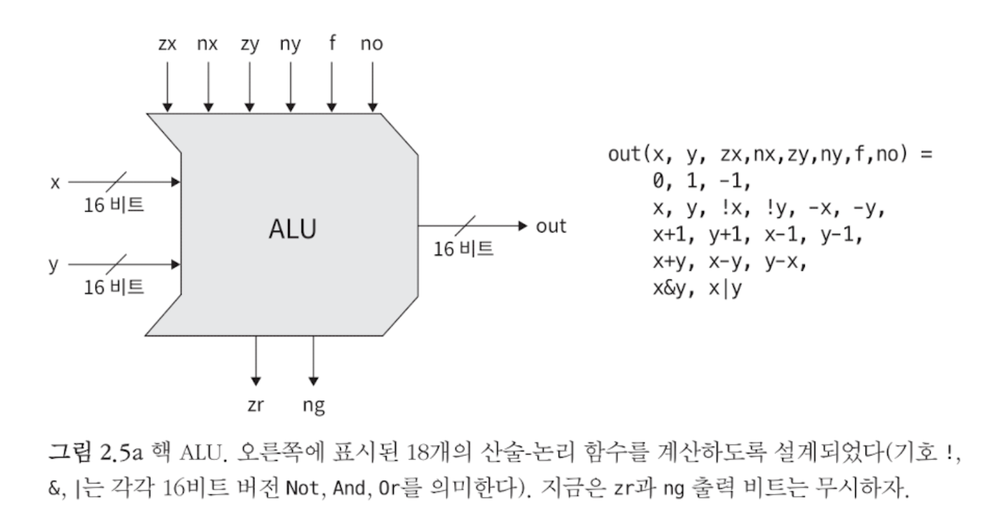
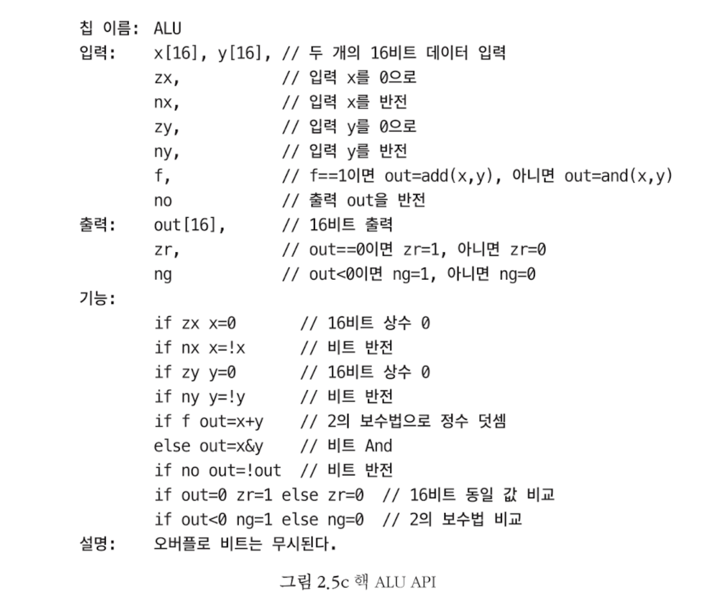

# From Nand To Tetris

## Project2 - Boolean Arithmetic

(zx, zy) 먼저 x, y를 0 또는 1로 설정한다.

(nx, ny) 그 다음 결과값의 부호를 바꾸거나 바꾸지 않는다.

(f) 처리된 값에 대하여 + 또는 &를 계산한다.

(no) 최종 결과값의 부호를 바꾸거나 바꾸지 않는다.

### ALU

- **Why?**

- **What?**: CPU의 핵심 부품으로써, 산술 및 논리 연산을 수행한다.
  
  - **Interface** 
  
- **How?** 핵 ALU API를 구체적으로 구현해보자.

  - ~~~shell
    # ALU (Arithmetic Logic Unit):
    # Computes out = one of the following functions:
    #                0, 1, -1,
    #                x, y, !x, !y, -x, -y,
    #                x + 1, y + 1, x - 1, y - 1,
    #                x + y, x - y, y - x,
    #                x & y, x | y
    # on the 16-bit inputs x, y,
    # according to the input bits zx, nx, zy, ny, f, no.
    # In addition, computes the two output bits:
    # if (out == 0) zr = 1, else zr = 0
    # if (out < 0)  ng = 1, else ng = 0
    
    # Implementation: Manipulates the x and y inputs
    # and operates on the resulting values, as follows:
    # if (zx == 1) sets x = 0        // 16-bit constant
    # if (nx == 1) sets x = !x       // bitwise not
    # if (zy == 1) sets y = 0        // 16-bit constant
    # if (ny == 1) sets y = !y       // bitwise not
    # if (f == 1)  sets out = x + y  // integer 2's complement addition
    # if (f == 0)  sets out = x & y  // bitwise and
    # if (no == 1) sets out = !out   // bitwise not
    CHIP ALU {
        IN  
            x[16], y[16],  # 16-bit inputs        
            zx, # zero the x input?
            nx, # negate the x input?
            zy, # zero the y input?
            ny, # negate the y input?
            f,  # compute (out = x + y) or (out = x & y)?
            no; # negate the out output?
        OUT 
            out[16], # 16-bit output
            zr,      # if (out == 0) equals 1, else 0
            ng;      # if (out < 0)  equals 1, else 0
    
        PARTS:
        # zx, nx -- 방법 1
        Mux16(a=x, b=false, sel=zx, out=zerox); # zx
        Not16(in=zerox, out=notx);
        Mux16(a=zerox, b=notx, sel=nx, out=nxout); # nx
        
        # zy -- 방법2
        And16(a=y, b=false, out=zeroy);
        Mux16(a=y, b=zeroy, sel=zy, out=zyout); # zy
        # ny
        Not16(in=zyout, out=notyout);
        Mux16(a=zyout, b=notyout, sel=ny, out=nyout); # ny
    
        # f
        And16(a=nxout, b=nyout, out=andxy); # &
        Add16(a=nxout, b=nyout, out=addxy); # +
        Mux16(a=andxy, b=addxy, sel=f, out=fout); # f
    
        # no
        Not16(in=fout, out=notfout);
        Mux16(a=fout, b=notfout, sel=no, out=out); # no
    }
    ~~~
  

