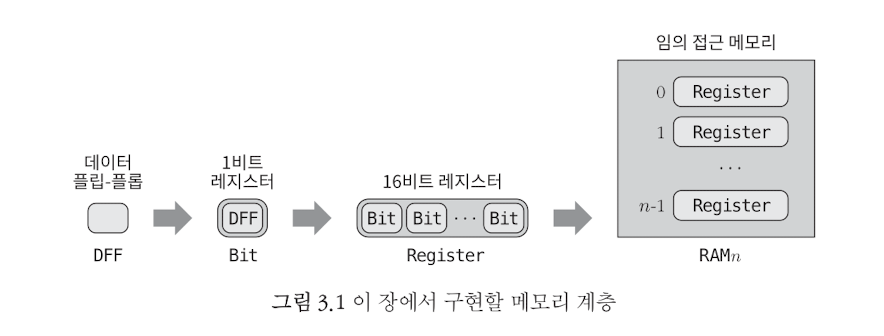
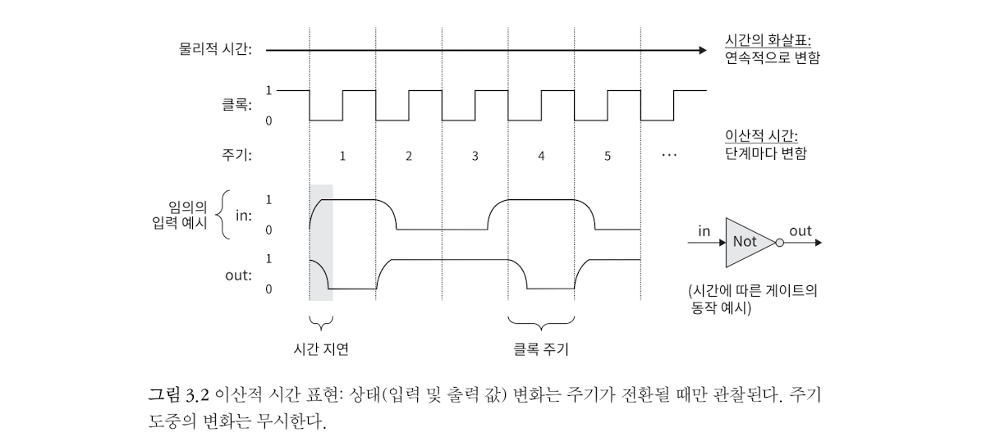
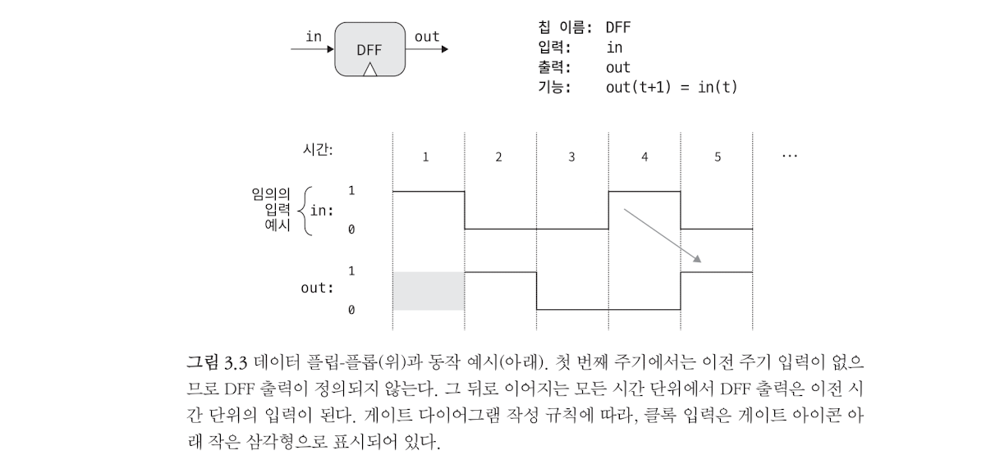
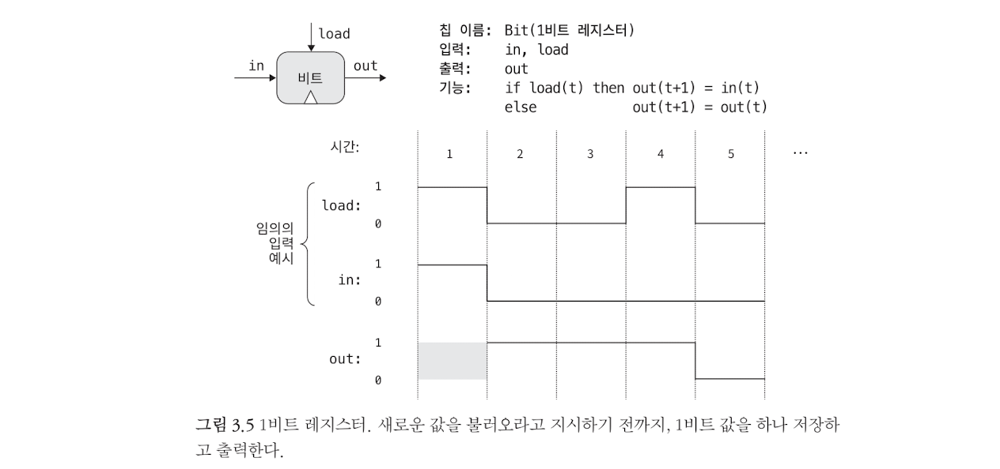
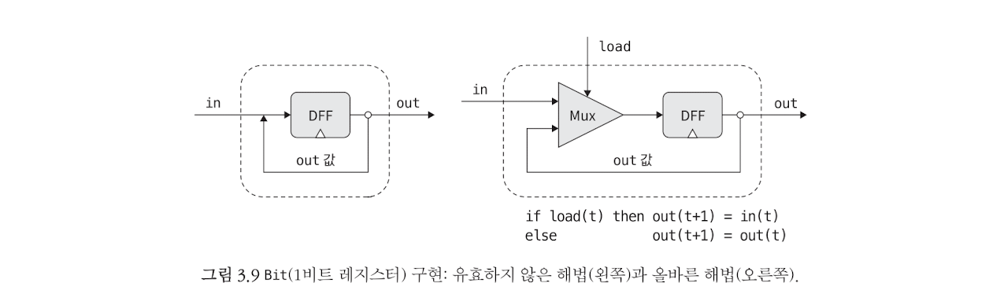
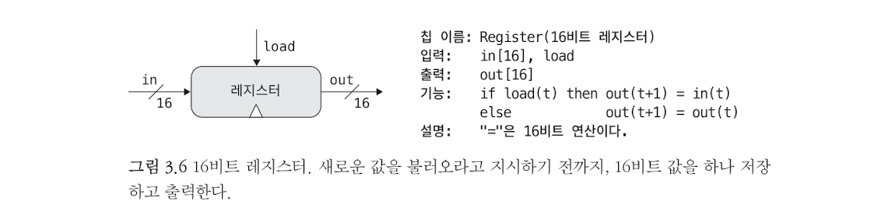

# From Nand To Tetris

## Project3 - Memory

- 메모리 장치들을 구현해본다. 시간이 지나도 데이터를 유지할 필요가 있기 때문이다.

- 이 장에서는 논리 게이트를 이용하여 일정 시간 동안 값을 저장하는 방법, 즉 변수가 값을 ‘기록’하고, 다른 값을 설정할 때까지 그 값을 유지하게 하는 방법을 배울 것이다. 이 작업을 위하여 메모리 칩을 개발한다.

- Ch01, 02에서 다룬 칩처럼 시간과 무관한 칩을 combinational chip이라고 부른다. 이 장에서는 sequential chip을 만들게 된다.

- 시간은 틱과 톡이라는 2진신호를 연속적으로 생성하는 클록을 이용하여 모델링 할 수 있다.

---

메모리 장치: 시간이 지나도 데이터를 유지한다는 추상화 개념을 도입하기 위한 것.

##### 클럭 신호와 동기화 개념

- 컴퓨터 과학자는 시간을 연속적으로 보지 않는다. ‘주기’를 단위로 하여 이산적인 개념으로 접근한다.

- Clock signal은 일정한 주기로 high(1)와 low(0)를 반복한다. 상태가 순간(0->1, 1->0)을 clock edge라고 하며, 회로는 일반적으로 이 순간에 동작을 수행한다. 그리고 이것을 동기화라고 한다.
- 동기화 함으로써 race condition을 방지할 수 있고, 시간 지연으로 인한 무작위성을 줄일 수 있다.
  - 주기 n과 주기 n+1에서는 상태를 확인하지만 그 중간에 일어나는 일에는 관심이 없다.
  - 주기를 시간 지연 보다는 살짝 길게 잡아야 한다.

> cf> Race Condition(경쟁 상태)
>
> 어떤 시스템에 둘 이상의 입력이 가해졌을 때, 그 입력의 순서나 타이밍에 따라 결과 값이 영향을 받아 시스템이 예상치 못하는 동작을 하는 상태를 가리킨다.

---

### DFF

- 저장이라는 추상적 개념을 실현하기 위한 저수준 장치이다. 

- `out(t) = in(t-1)`라는 간단한 동작을 구현한다. 이전 시간 단위(=주기)의 입력 값을 출력한다.

- clock edge에 입력 값을 저장한다.
- 기본적인 메모리 요소이며, 레지스터와 더 큰 메모리 유닛이 이를 기반으로 한다.

---

### Bit(1-bit register)

- `load` bit이 설정(`1`)되어 있지 않으면, 레지스터는 잠금 상태, 현재 상태를 유지한다.

- Why? 1-bit register를 구현하고, 이를 이용하여 점진적으로 더 큰 메모리 유닛을 만들 것이다. 이 과정을 거치면서 모듈화와 재사용을 직접 수행해본다.

- What? 1-bit의 정보(0 또는 1)를 저장한다.

- How? `load`가 1이면 레지스터에 새 값을 설정하고, 0이면 이전 값을 설정하라.

  

  - ~~~c
    /**
     * 1-bit register:
     * If load is asserted, the register's value is set to in;
     * Otherwise, the register maintains its current value:
     * if (load(t)) out(t+1) = in(t), else out(t+1) = out(t)
     */
    CHIP Bit {
        IN in, load;
        OUT out;
    
        PARTS:
        Mux(a=dout, b=in, sel=load, out=newstate);
        DFF(in=newstate, out=out, out=dout);
    }
    ~~~

---

### Register(16-bit register)

How? `in[16]`를 처리하기 위하여 16개의 1-bit register를 사용한다.

~~~c
/**
 * 16-bit register:
 * If load is asserted, the register's value is set to in;
 * Otherwise, the register maintains its current value:
 * if (load(t)) out(t+1) = int(t), else out(t+1) = out(t)
 */
CHIP Register {
    IN in[16], load;
    OUT out[16];

    PARTS:
    Bit(in=in[0], load=load, out=out[0]);
    Bit(in=in[1], load=load, out=out[1]);
    Bit(in=in[2], load=load, out=out[2]);
    Bit(in=in[3], load=load, out=out[3]);
    Bit(in=in[4], load=load, out=out[4]);
    Bit(in=in[5], load=load, out=out[5]);
    Bit(in=in[6], load=load, out=out[6]);
    Bit(in=in[7], load=load, out=out[7]);
    Bit(in=in[8], load=load, out=out[8]);
    Bit(in=in[9], load=load, out=out[9]);
    Bit(in=in[10], load=load, out=out[10]);
    Bit(in=in[11], load=load, out=out[11]);
    Bit(in=in[12], load=load, out=out[12]);
    Bit(in=in[13], load=load, out=out[13]);
    Bit(in=in[14], load=load, out=out[14]);
    Bit(in=in[15], load=load, out=out[15]);
}
~~~

