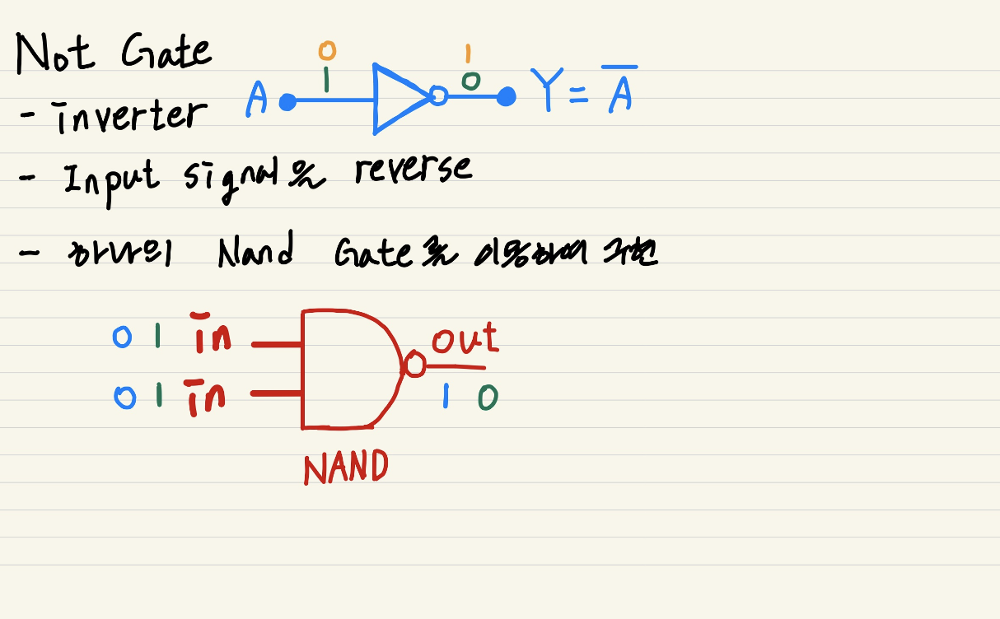
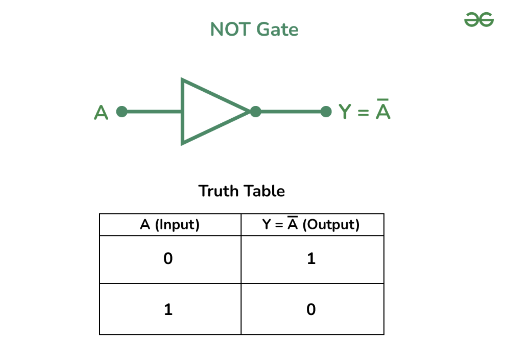
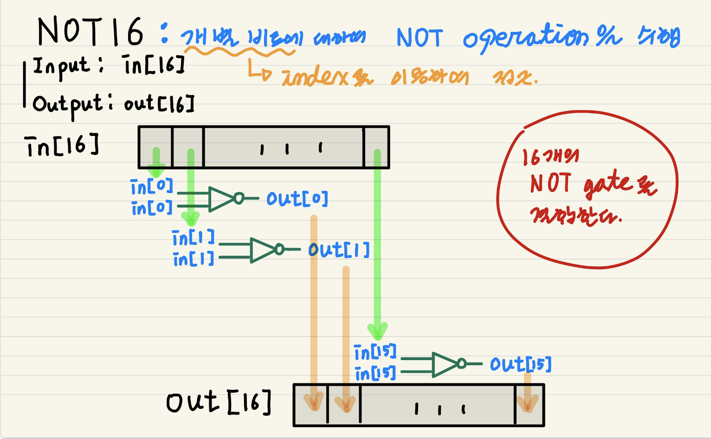
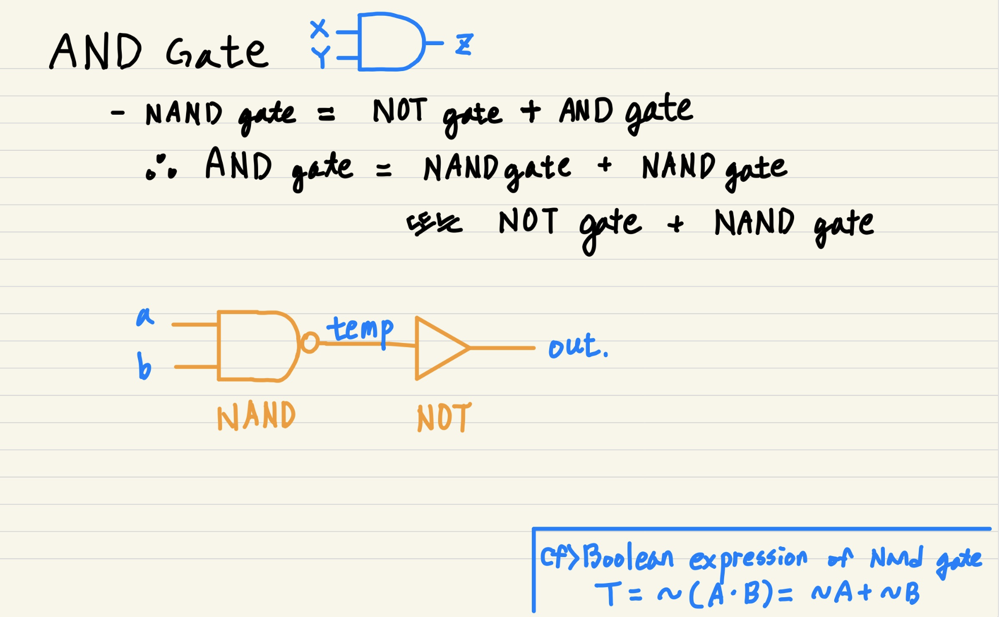
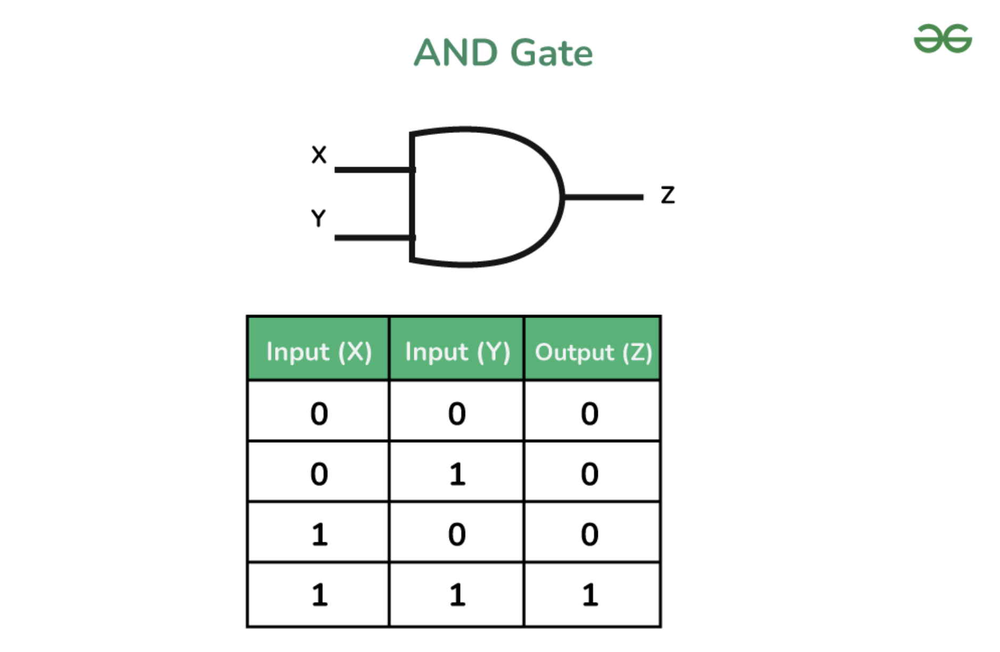
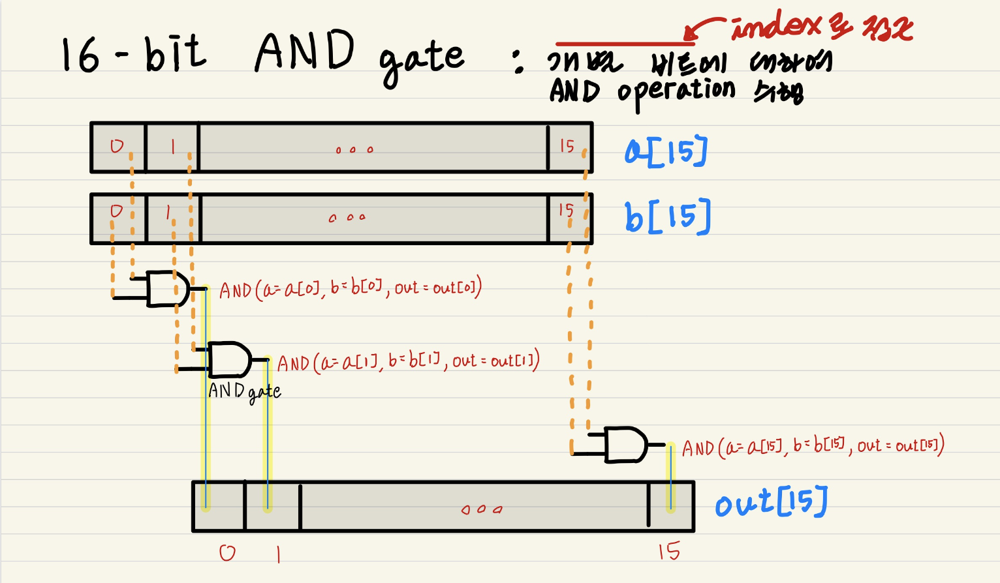

# From Nand To Tetris

## Project1 - Boolean Logic

### 1. Implementation of NOT Gate from NAND Gate

**About Not gate**

- **Why?** input signal을 reverse한다. Manipulation, Inverter

- **What?** If the input is 1 (high), the output is 0 (low), and if the input is 0 (low), the output is 1 (high).
  - **Interface of Not Gate** 

- **How**? NAND Gate를 이용하여 구현한다.
  
  - ~~~shell
    # * Not gate:
    # * if (in) out = 0, else out = 1
    CHIP Not {
        IN in;
        OUT out;
    
        PARTS:
        Nand(a=in, b=in, out=out);
    }
    ~~~
  

### 2. Implementation of NOT16 from NAND Gate

**About NOT16 Gate**

- **Why?** 2의 보수 연산

  - 멀티비트: 16비트 단위의 연산을 수행하기 위함이다(이러한 병렬화는 시스템의 전반적인 성능을 향상시킨다).

- **What?** 16-bit의 input(`in[16]`)을 받아 각 비트(`index=0..15`)를 반전시킨다. (`out[16]`)

- **How?** 개별 비트에 대하여 NOT operation을 수행한다.

  - ~~~shell
    # * 16-bit Not gate:
    # * for i = 0, ..., 15:
    # * out[i] = Not(a[i])
    CHIP Not16 {
        IN in[16];
        OUT out[16];
    
        PARTS:
        Not(in=in[0], out=out[0]);
        Not(in=in[1], out=out[1]);
        Not(in=in[2], out=out[2]);
        Not(in=in[3], out=out[3]);
        Not(in=in[4], out=out[4]);
        Not(in=in[5], out=out[5]);
        Not(in=in[6], out=out[6]);
        Not(in=in[7], out=out[7]);
        Not(in=in[8], out=out[8]);
        Not(in=in[9], out=out[9]);
        Not(in=in[10], out=out[10]);
        Not(in=in[11], out=out[11]);
        Not(in=in[12], out=out[12]);
        Not(in=in[13], out=out[13]);
        Not(in=in[14], out=out[14]);
        Not(in=in[15], out=out[15]);
    }
    ~~~

---

### 3. Implementation of AND Gate from NAND Gate

**About And Gate**

- **Why?** logical conjunction (논리곱, ∧)을 구현하기 위함이다.
  
- **What?** 두 input signal에 대하여, 모두 high(`1`)인 경우에만 high(`1`)을 출력한다.
  
  - Boolean expression of AND gate: `𝑋.𝑌=𝑍`
  - Interface
  
- **How?**  `NAND`와 `NOT` gate를 이용하여 구현할 수 있다.

  - ~~~shell
    # * And gate:
    # * if (a and b) out = 1, else out = 0 
    CHIP And {
        IN a, b;
        OUT out;
        
        PARTS:
        Nand(a=a, b=b, out=temp);
        Not(in=temp, out=out);
        }
    ~~~

- related: 
  - `NAND` Gate

### 4. Implementation of AND16 from NAND Gate

**About AND16 Gate**

- **Why?** 비트 마스킹(특정 비트를 선택적으로 추출)

  - 멀티비트: 16비트 단위의 연산을 수행하기 위함이다(이러한 병렬화는 시스템의 전반적인 성능을 향상시킨다).

- **What?** 16-bit의 input(`a[16]`, `b[16]`)에 대하여 비트별 AND operation을 수행한다. (`out[16]`)

- **How?** 개별 비트에 대하여 AND operation을 수행한다.

  - ~~~shell
    # * 16-bit And gate:
    # * for i = 0, ..., 15:
    # * out[i] = a[i] And b[i] 
    CHIP And16 {
        IN a[16], b[16];
        OUT out[16];
    
        PARTS:
        And(a=a[0], b=b[0], out=out[0]);
        And(a=a[1], b=b[1], out=out[1]);
        And(a=a[2], b=b[2], out=out[2]);
        And(a=a[3], b=b[3], out=out[3]);
        And(a=a[4], b=b[4], out=out[4]);
        And(a=a[5], b=b[5], out=out[5]);
        And(a=a[6], b=b[6], out=out[6]);
        And(a=a[7], b=b[7], out=out[7]);
        And(a=a[8], b=b[8], out=out[8]);
        And(a=a[9], b=b[9], out=out[9]);
        And(a=a[10], b=b[10], out=out[10]);
        And(a=a[11], b=b[11], out=out[11]);
        And(a=a[12], b=b[12], out=out[12]);
        And(a=a[13], b=b[13], out=out[13]);
        And(a=a[14], b=b[14], out=out[14]);
        And(a=a[15], b=b[15], out=out[15]);
    }
    ~~~
