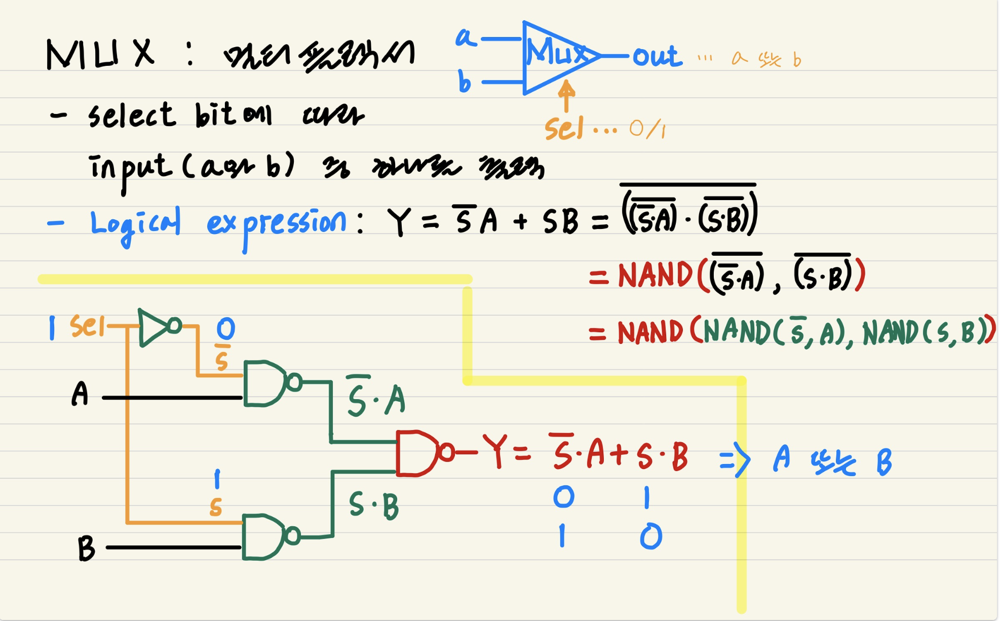
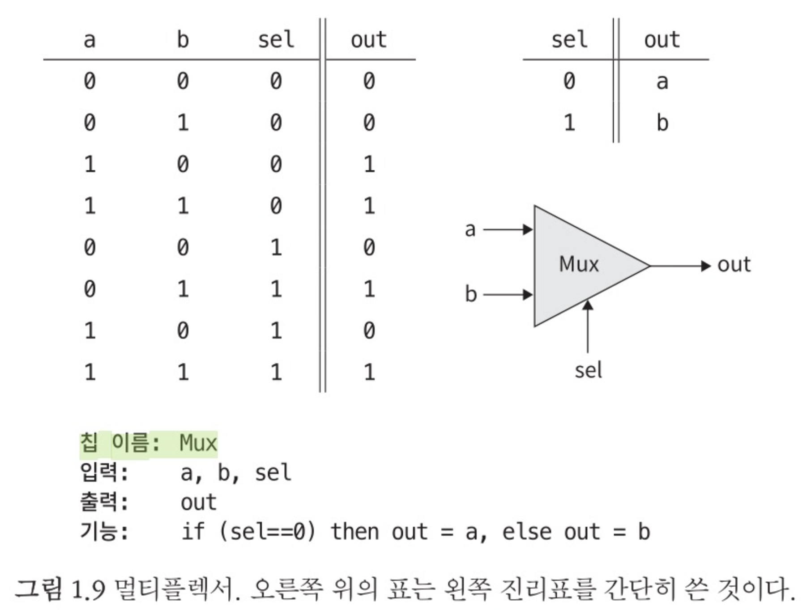
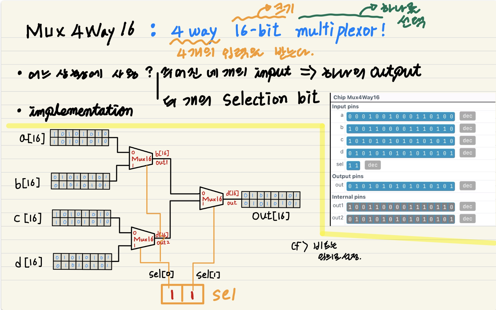
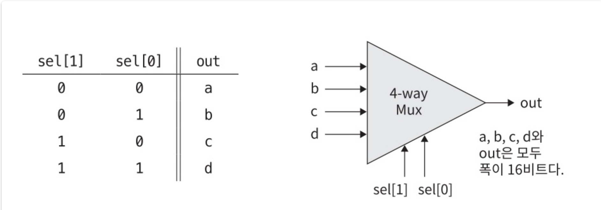
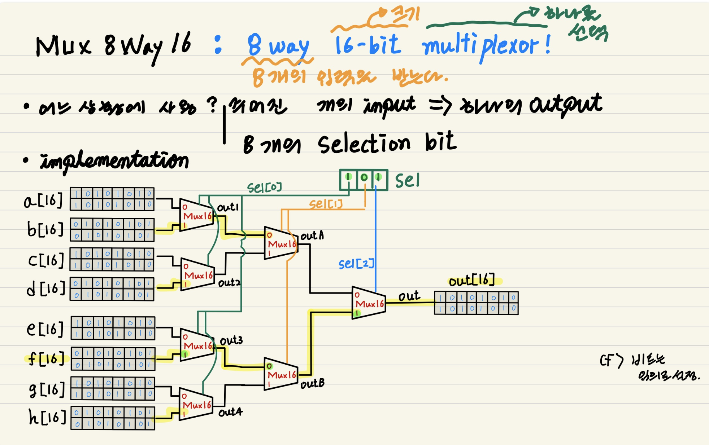
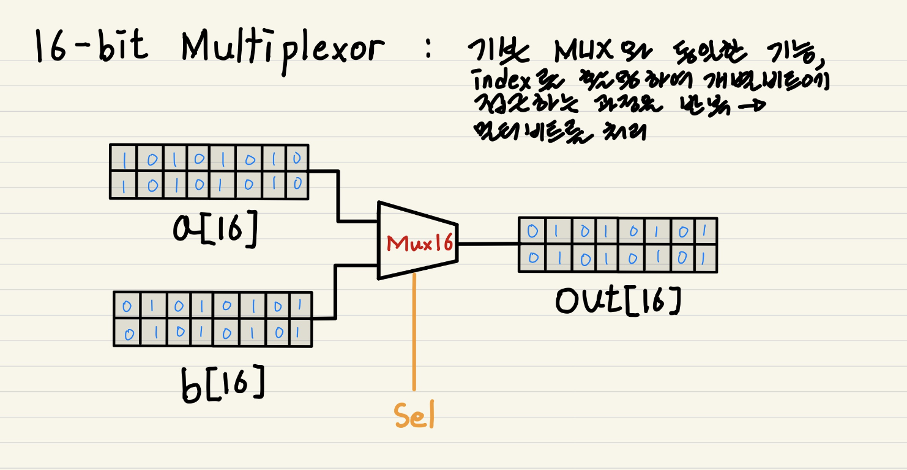
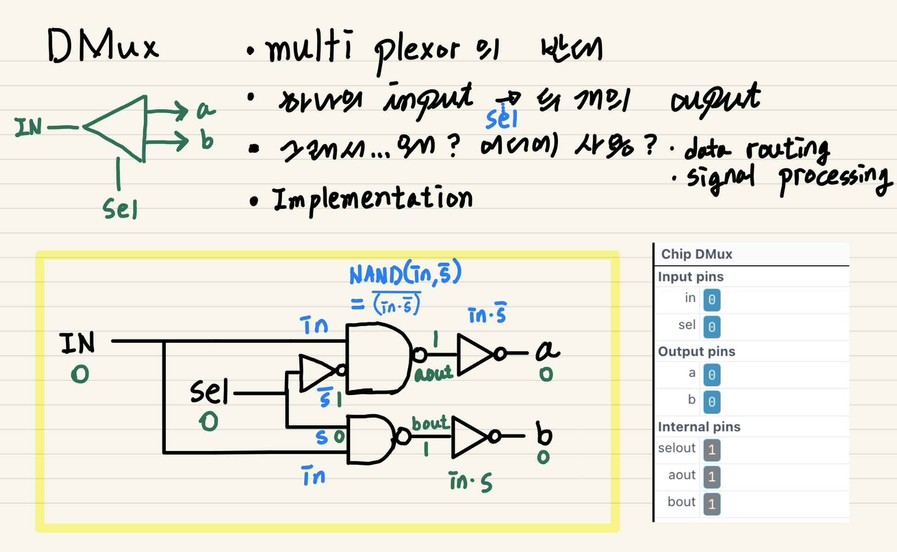
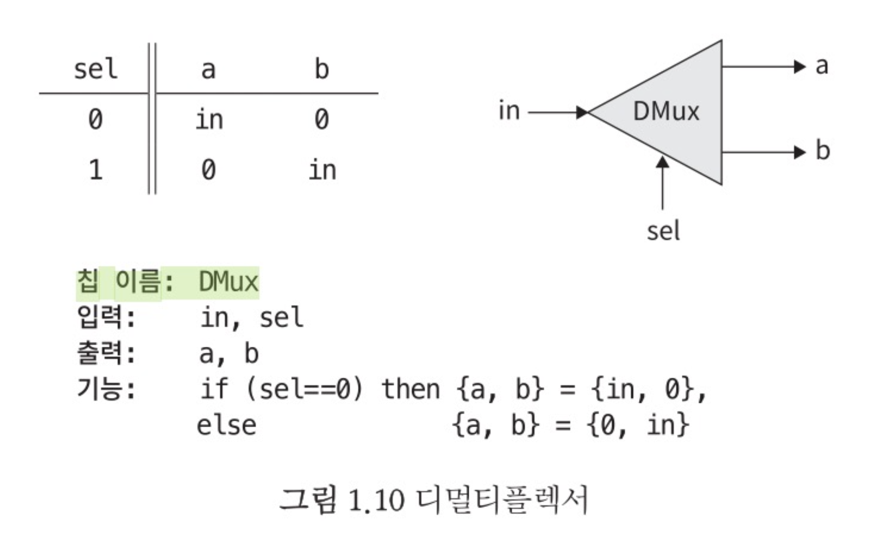
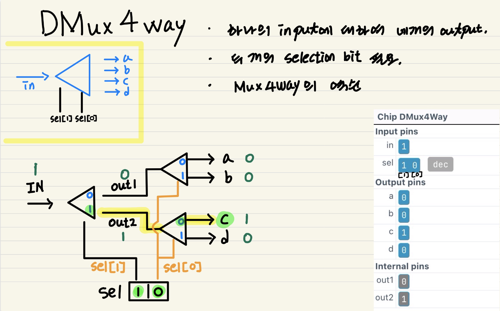
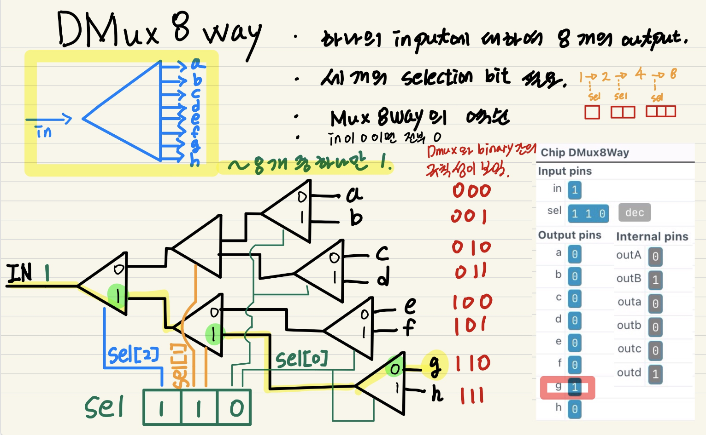

# From Nand To Tetris

## Project1 - Boolean Logic

### 1. Implementation of MUX from NAND Gate

**About MUX Gate**

- **Why?**
  - ALU의 기본 연산(+, -, *, /) 중에서 어떤 연산을 선택할 지 고를 수 있다. 네트워크 스위칭 용도로 사용된다(데이터 패킷을 목적지로 라우팅).
  
- **What?** Data selector, 여러 input signal 중 select bits에 따라 하나를 선택하여 출력한다.
  
  - Interface
  
- How? 드 모르간의 정리를 이용한다. Not Gate와 NAND Gate를 이용한다.
  - Boolean Expression: `Y = (s'A + sB)`	
  
  - ~~~shell
    # * Multiplexor:
    # * if (sel = 0) out = a, else out = b
    CHIP Mux {
        IN a, b, sel;
        OUT out;
    
        PARTS:
        Not(in=sel, out=notsel);
        
        Nand(a=a, b=notsel, out=aout);
        Nand(a=sel, b=b, out=bout);
        
        Nand(a=aout, b=bout, out=out);
    }
    ~~~

---

### 2. Implementation of Mux4Way16 from NAND Gate

**About Mux4Way16 Gate**

- **Why?** 멀티비트 값들을 처리하기 위함이다. 여러 16-bit input signal 중 하나를 선택한다.

- **What?** 4way로 16-bit input(`a[16]`, `b[16]`, `c[16]`, `d[16]`)을 받는다, 2-bit selection bit(`sel[2]`)에 따라 그 중 하나를 선택하여  output(`out[16]`).
  
  - **Interface** 
  
- How? 네 개의 input이 1) `sel[0]`와 함께 두 개의 Mux를 통과, 두 개의 중간값이 2) `sel[1]`와 함께 한 개의 Mux를 통과
  - ~~~shell
    # * 4-way 16-bit multiplexor:
    # * out = a if sel = 00
    # *       b if sel = 01
    # *       c if sel = 10
    # *       d if sel = 11
    CHIP Mux4Way16 {
        IN a[16], b[16], c[16], d[16], sel[2];
        OUT out[16];
        
        PARTS:
        Mux16(a=a, b=b, sel=sel[0], out=out1);
        Mux16(a=c, b=d, sel=sel[0], out=out2);
    
        Mux16(a=out1, b=out2, sel=sel[1], out=out);
    }
    ~~~

---

### 3. Implementation of Mux8Way16 from NAND Gate

**About Mux8Way Gate**

- **Why?** 멀티비트 값들을 처리하기 위함이다. 여러 16-bit input signal 중 하나를 선택한다.
- **What?** 8way로 16-bit input(`a[16]` .. `h[16]`)을 받는다, 3-bit selection bit(`sel[3]`)에 따라 그 중 하나를 선택하여  output(`out[16]`).

- **How?** 여덟 개의 input이 1) `sel[0]`와 함께 네 개의 Mux를 통과, 네 개의 중간값이 2) `sel[1]`와 함께 두 개의 Mux를 통과, 3) `sel[2]`와 함께 두 개의  중간값이 하나의  Mux를 통과

  - ~~~shell
    # * 8-way 16-bit multiplexor:
    # * out = a if sel = 000
    # *       b if sel = 001
    # *       c if sel = 010
    # *       d if sel = 011
    # *       e if sel = 100
    # *       f if sel = 101
    # *       g if sel = 110
    # *       h if sel = 111
    CHIP Mux8Way16 {
        IN a[16], b[16], c[16], d[16],
           e[16], f[16], g[16], h[16],
           sel[3];
        OUT out[16];
    
        PARTS:
        Mux16(a=a, b=b, sel=sel[0], out=out1);
        Mux16(a=c, b=d, sel=sel[0], out=out2);
        Mux16(a=out1, b=out2, sel=sel[1], out=outA);
    
        Mux16(a=e, b=f, sel=sel[0], out=out3);
        Mux16(a=g, b=h, sel=sel[0], out=out4);
        Mux16(a=out3, b=out4, sel=sel[1], out=outB);
    
        Mux16(a=outA, b=outB, sel=sel[2], out=out);
    }
    ~~~

---

### 4. Implementation of MUX16 from NAND Gate

**About MUX16 Gate**

- **Why?** 멀티비트: 16비트 단위의 연산을 수행하기 위함이다(이러한 병렬화는 시스템의 전반적인 성능을 향상시킨다).

- **What?** 16-bit input(`a[16]`, `b[16]`) 중 하나를 선택한다.

- **How?** index를 활용하여 개별 비트에 접근한다.

  - ~~~shell
    #/**
    # * 16-bit multiplexor: 
    # * for i = 0, ..., 15:
    # * if (sel = 0) out[i] = a[i], else out[i] = b[i]
    # */
    CHIP Mux16 {
        IN a[16], b[16], sel;
        OUT out[16];
    
        PARTS:
        Mux(a=a[0], b=b[0], sel=sel, out=out[0]);
        Mux(a=a[1], b=b[1], sel=sel, out=out[1]);
        Mux(a=a[2], b=b[2], sel=sel, out=out[2]);
        Mux(a=a[3], b=b[3], sel=sel, out=out[3]);
        Mux(a=a[4], b=b[4], sel=sel, out=out[4]);
        Mux(a=a[5], b=b[5], sel=sel, out=out[5]);
        Mux(a=a[6], b=b[6], sel=sel, out=out[6]);
        Mux(a=a[7], b=b[7], sel=sel, out=out[7]);
        Mux(a=a[8], b=b[8], sel=sel, out=out[8]);
        Mux(a=a[9], b=b[9], sel=sel, out=out[9]);
        Mux(a=a[10], b=b[10], sel=sel, out=out[10]);
        Mux(a=a[11], b=b[11], sel=sel, out=out[11]);
        Mux(a=a[12], b=b[12], sel=sel, out=out[12]);
        Mux(a=a[13], b=b[13], sel=sel, out=out[13]);
        Mux(a=a[14], b=b[14], sel=sel, out=out[14]);
        Mux(a=a[15], b=b[15], sel=sel, out=out[15]);
    }
    ~~~

---

### 5. Implementation of DMUX from NAND Gate

**About DMUX Gate**

- **Why?** Data routing, Signal processing

- **What?** Data distributor, The demultiplexer takes a single input signal and generates several output signals.

  - **Interface** 

- **How?** input signal에 대하여 select bit와 AND operation을 수행하여 여러 개의 output signal을 만들어낸다. NOT Gate와 AND Gate를 이용한다.

  - ~~~shell
    # * Demultiplexor:
    # * [a, b] = [in, 0] if sel = 0
    # *          [0, in] if sel = 1
    CHIP DMux {
        IN in, sel;
        OUT a, b;
    
        PARTS:
        
        Not(in=sel, out=selout);
    
        # Nand(a=in, b=selout, out=aout);
        # Not(in=aout, out=a);
        And(a=selout, b=in, out=a);
    
        # Nand(a=sel, b=in, out=bout);
        # Not(in=bout, out=b);
        And(a=sel, b=in, out=b);
    }
    ~~~

---

### 6. Implementation of DMUX4Way from NAND Gate

비트는 오른쪽에서 왼쪽으로 인덱스가 부여된다.

**About DMUX4way Gate**

- **Why?** Data routing, Signal processing

- **What?** Data distributor, The demultiplexer takes a single input signal and generates several output signals.(ex.`0, 0, 1, 0`)

- **How?** 1) `sel[1]`와 input signal이 DMux를 통과하여 두 개의 중간값을 만든다, 2) 이들이 각각은 `sel[0]`와 두 DMux를 통과하여 네 개의 output을 만든다.

  - ~~~shell
    # * 4-way 16-bit multiplexor:
    # * out = a if sel = 00
    # *       b if sel = 01
    # *       c if sel = 10
    # *       d if sel = 11
    CHIP DMux4Way {
        IN in, sel[2];
        OUT a, b, c, d;
    
        PARTS:
        DMux(in=in, sel=sel[1], a=out1, b=out2);
    
        DMux(in=out1, sel=sel[0], a=a, b=b);
        DMux(in=out2, sel=sel[0], a=c, b=d);
    }
    ~~~

---

### 7. Implementation of DMUX8Way from NAND Gate

비트는 오른쪽에서 왼쪽으로 인덱스가 부여된다.

**About DMUX8Way Gate**

- **Why?** Data routing, Signal processing

- **What?** Data distributor, The demultiplexer takes a single input signal and generates several output signals.(ex.`0, 0, 1, 0`)

  하나의 input에 대하여 여덟 개의 output(ex. `0, 0, 0, 0, 0, 0, 1, 0`), 이때 `sel[3]` 필요하다.

- **How?** 1) `sel[2]`와 input signal이 DMux를 통과하여 두 개의 중간값을 만든다, 2) 이들이 각각은 `sel[1]`와 두 DMux를 통과하여 네 개의 중간값을 만든다, 3) 이들 각각은 `sel[0]`와 네 DMux를 통과하여 8개의 output을 만든다.

  - ~~~shell
    # 8-way demultiplexor:
    # [a, b, c, d, e, f, g, h] = [in, 0,  0,  0,  0,  0,  0,  0] if sel = 000
    #                            [0, in,  0,  0,  0,  0,  0,  0] if sel = 001
    #                            [0,  0, in,  0,  0,  0,  0,  0] if sel = 010
    #                            [0,  0,  0, in,  0,  0,  0,  0] if sel = 011
    #                            [0,  0,  0,  0, in,  0,  0,  0] if sel = 100
    #                            [0,  0,  0,  0,  0, in,  0,  0] if sel = 101
    #                            [0,  0,  0,  0,  0,  0, in,  0] if sel = 110
    #                            [0,  0,  0,  0,  0,  0,  0, in] if sel = 111
    CHIP DMux8Way {
        IN in, sel[3];
        OUT a, b, c, d, e, f, g, h;
    
        PARTS:
        DMux(in=in, sel=sel[2], a=outA, b=outB);
    
        DMux(in=outA, sel=sel[1], a=outa, b=outb);
        DMux(in=outB, sel=sel[1], a=outc, b=outd);
    
        DMux(in=outa, sel=sel[0], a=a, b=b);
        DMux(in=outb, sel=sel[0], a=c, b=d);
        DMux(in=outc, sel=sel[0], a=e, b=f);
        DMux(in=outd, sel=sel[0], a=g, b=h);
    }
    ~~~

