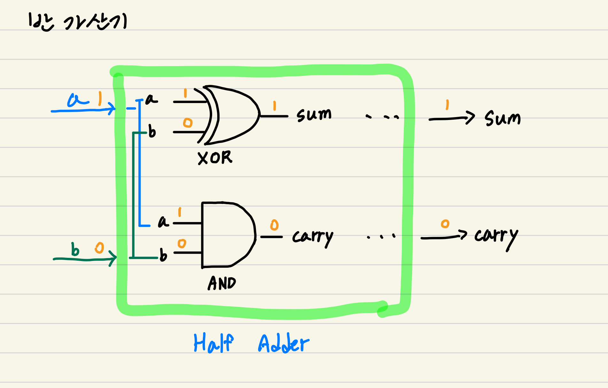
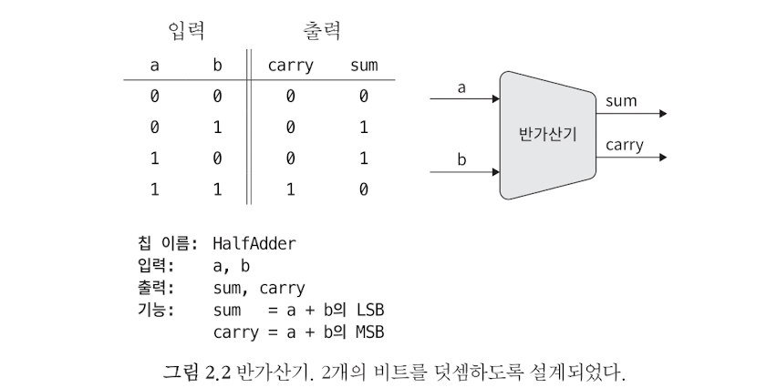
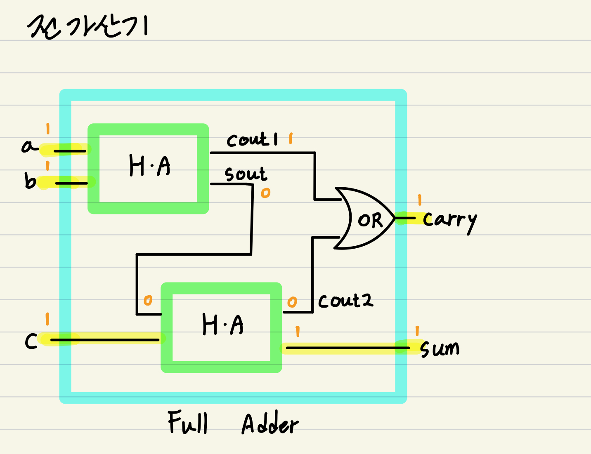
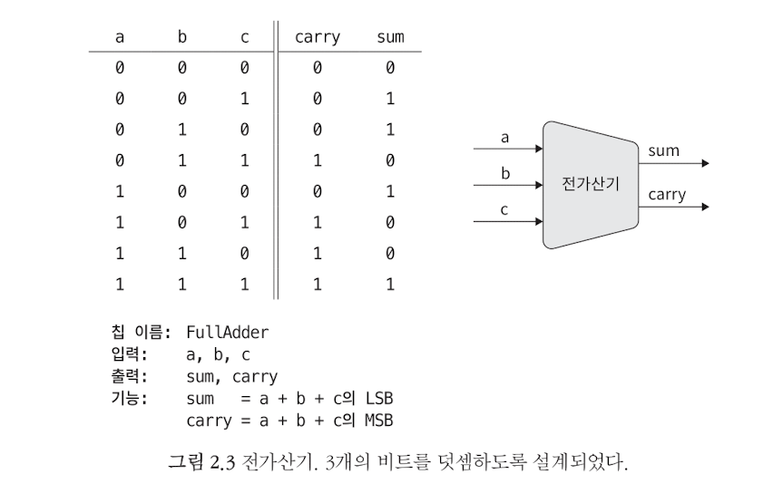
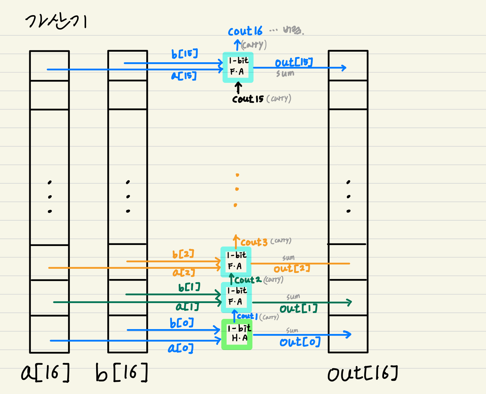
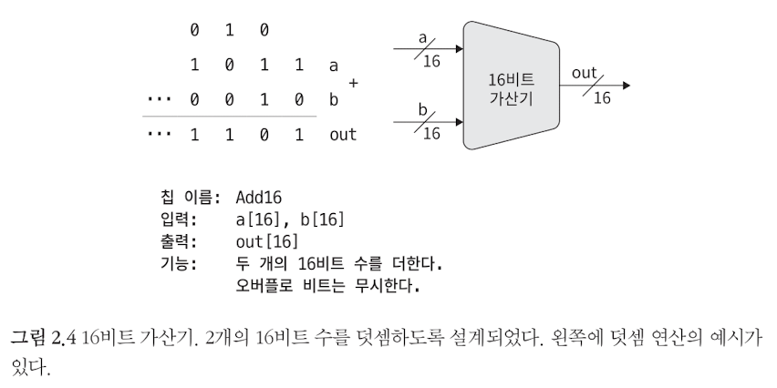
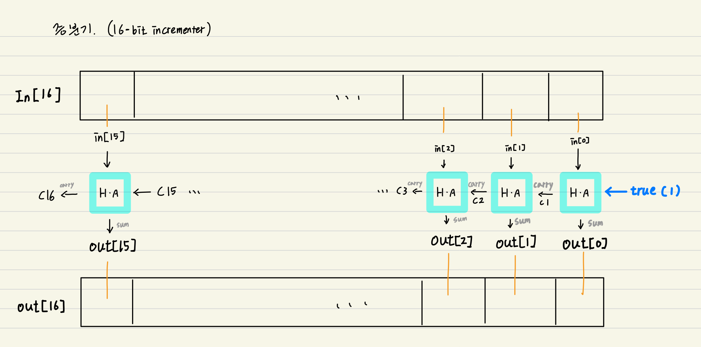
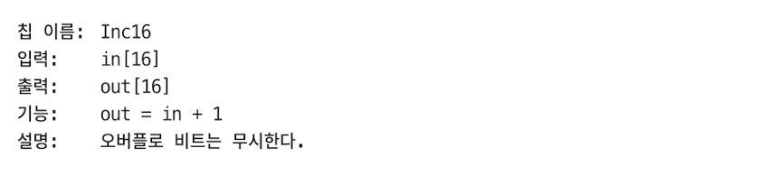

# From Nand To Tetris

## Project2 - Boolean Arithmetic

### Some notes

이 장에서는 숫자를 표현하고 산술연산을 하기 위한 칩들을 개발한다. 제1장에서 만든 논리게이트를 활용한다.

fixed word size: 실제 정수는 무한하지만, 컴퓨터는 숫자를 표현하기 위해 fixed word size를 사용하는 유한머신이다. 여기서  word size란, 컴퓨터가 basic chunk of info(정보 단위, ex. integer)를 나타내기 위해 사용하는 bit 수를 말한다. 예를 들어 integer의 경우 8-, 16-, 32-, 64-bit register가 사용된다.

2진 덧셈은 두 2진수의 least significant bit(LSB, 최하위 비트)부터 시작하여 most significant bit(MSB, 최상위 비트)까지 진행된다. 이 과정에서 carry bit이 발생하면 다음 bit에 더해준다. 마지막으로 최상위 비트에서 carry bit이 발생하면 이를 오버플로우라고 한다. 본 과제에서는 버리는 방식을 채택한다.

2진 코드로 음수는 어떻게 나타낼까? 2의 보수법을 활용한다.

n비트의 2진법 체계에는 다음과 같은 특징들이 있다. 1) 음수가 아닌 수의 코드는 0으로 시작, 2) 음수의 코드는 1로 시작, 3) x의 코드에서 -x를 구하려면 x의 모든 비트를 뒤집고 그 결과에 1을 더한다.

---

### HalfAdder(반가산기)

**About Half Adder**

- **Why?**

- **What?** 두 비트(1-bit binary numbers)를 더한다. 그 결과 `sum`과 `carry`가 발생한다.
  - **Interface**

- How? sum을 구하기 위해 XOR gate를,  carry를 구하기 위해 AND gate를 이용한다.

  - ~~~shell
    #@ * Computes the sum of two bits.
    CHIP HalfAdder {
        IN a, b;    // 1-bit inputs
        OUT sum,    // Right bit of a + b 
            carry;  // Left bit of a + b
    
        PARTS:
        Xor(a=a, b=b, out=sum);
        And(a=a, b=b, out=carry);
    }
    ~~~

    

---

### FullAdder(전가산기)

**About Half Adder**

- **Why?**

- **What?** 세 비트를 더한다. 그 결과 `sum`과 `carry`가 발생한다.
  - **Interface** 

- **How?** 두 개의 Half Adder와 OR gate를 필요로 한다.

  - ~~~shell
    # * Computes the sum of three bits.
    CHIP FullAdder {
        IN a, b, c;  // 1-bit inputs
        OUT sum,     // Right bit of a + b + c
            carry;   // Left bit of a + b + c
    
        PARTS:
        HalfAdder(a=a, b=b, sum=sout, carry=cout1);
        HalfAdder(a=sout, b=c, sum=sum, carry=cout2);
        Or(a=cout1, b=cout2, out=carry);
    }
    ~~~

    

---

### Add16(adder, 가산기)

**About Half Adder**

- **Why?** 컴퓨터는 integer를 fixed-word-size로 표현한다(6-, 16, 32-, 64-bit). 이처럼 n-bit를 병렬적으로 처리하여 시스템의 전반적인 성능을 향상시킬 수 있다.

- **What?** 두 16-bit 숫자(`a[16]`, `b[16]`)를 더한다.
  - **Interface** 

- How? 개별 비트에 대하여 1-bit Half Adder 또는 1-bit Full Adder를 적용한다.

  - ~~~shell
    # * 16-bit adder: Adds two 16-bit two's complement values.
    # * The most significant carry bit is ignored.
    CHIP Add16 {
        IN a[16], b[16];
        OUT out[16];
    
        PARTS:
        HalfAdder(a=a[0], b=b[0], sum=out[0], carry=cout1);
        FullAdder(a=a[1], b=b[1], c=cout1, sum=out[1], carry=cout2);
        FullAdder(a=a[2], b=b[2], c=cout2, sum=out[2], carry=cout3);
        FullAdder(a=a[3], b=b[3], c=cout3, sum=out[3], carry=cout4);
        FullAdder(a=a[4], b=b[4], c=cout4, sum=out[4], carry=cout5);
        FullAdder(a=a[5], b=b[5], c=cout5, sum=out[5], carry=cout6);
        FullAdder(a=a[6], b=b[6], c=cout6, sum=out[6], carry=cout7);
        FullAdder(a=a[7], b=b[7], c=cout7, sum=out[7], carry=cout8);
        FullAdder(a=a[8], b=b[8], c=cout8, sum=out[8], carry=cout9);
        FullAdder(a=a[9], b=b[9], c=cout9, sum=out[9], carry=cout10);
        FullAdder(a=a[10], b=b[10], c=cout10, sum=out[10], carry=cout11);
        FullAdder(a=a[11], b=b[11], c=cout11, sum=out[11], carry=cout12);
        FullAdder(a=a[12], b=b[12], c=cout12, sum=out[12], carry=cout13);
        FullAdder(a=a[13], b=b[13], c=cout13, sum=out[13], carry=cout14);
        FullAdder(a=a[14], b=b[14], c=cout14, sum=out[14], carry=cout15);
        FullAdder(a=a[15], b=b[15], c=cout15, sum=out[15], carry=cout16);
    
        
    }
    ~~~

  

---

### Inc16(증분기)

**About Half Adder**

- **Why?**

- **What?** 주어진 숫자(16-bit input)에 1을 더한다.
  - **Interface** 

- **How?** 개별 비트에 대하여 1-bit Half Adder를 연쇄적으로 적용한다. 이때, 최초의 HA에 1을 더한다.

  - ~~~shell
    # * 16-bit incrementer:
    # * out = in + 1
    CHIP Inc16 {
        IN in[16];
        OUT out[16];
    
        PARTS:
        HalfAdder(a=in[0], b=true, sum=out[0], carry=c1);
        HalfAdder(a=in[1], b=c1, sum=out[1], carry=c2);
        HalfAdder(a=in[2], b=c2, sum=out[2], carry=c3);
        HalfAdder(a=in[3], b=c3, sum=out[3], carry=c4);
        HalfAdder(a=in[4], b=c4, sum=out[4], carry=c5);
        HalfAdder(a=in[5], b=c5, sum=out[5], carry=c6);
        HalfAdder(a=in[6], b=c6, sum=out[6], carry=c7);
        HalfAdder(a=in[7], b=c7, sum=out[7], carry=c8);
        HalfAdder(a=in[8], b=c8, sum=out[8], carry=c9);
        HalfAdder(a=in[9], b=c9, sum=out[9], carry=c10);
        HalfAdder(a=in[10], b=c10, sum=out[10], carry=c11);
        HalfAdder(a=in[11], b=c11, sum=out[11], carry=c12);
        HalfAdder(a=in[12], b=c12, sum=out[12], carry=c13);
        HalfAdder(a=in[13], b=c13, sum=out[13], carry=c14);
        HalfAdder(a=in[14], b=c14, sum=out[14], carry=c15);
        HalfAdder(a=in[15], b=c15, sum=out[15], carry=c16);
    }
    ~~~