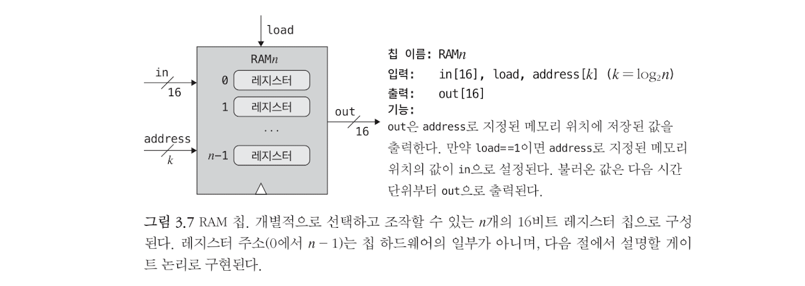
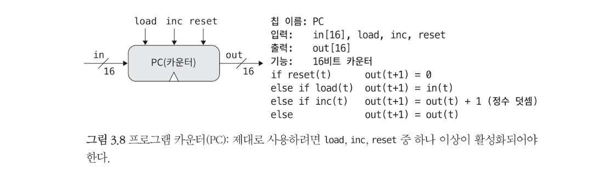

# From Nand To Tetris

## Project3 - Memory

---

### RAM(Random access memory)

- 임의 접근 메모리, n개의 register로 구성된다.
- 각 register에게 0부터 n-1까지의 주소를 할당하기 때문에 이 주소로 register를 선택하여 읽기/쓰기 작업을 수행할 수 있다.
- 임의로 선택된 register에 대한 즉각적인 접근이 가능하다. 이는 램의 크기나 주소와 무관하다.
- 읽기 연산(`load=0`), 쓰기 연산(`load=1`)

---

### RAM8

- 8개의 16-bit register로 구성된다. 
- 3-bit의 주소(000-111, 8개)로 특정 register에 접근하여 쓰기(`load=1`)를 하거나, 읽기(`load=0`, 현재 상태 출력)한다.

How?☄️

- `DMux8Way(in, sel, a..h)`: `load` bit을 8개의 register 중 하나로 라우팅하기 위해 사용한다.
- `Register`: 각 레지스터는 16-bit data를 저장한다.
  - 모든 레지스터는 16-bit input을 받지만, 단 하나의 register만의 `load=1`을 받는다(`DMux8Way`의 영향). 그리고 해당 레지스터만이 `in`을 저장하고 나머지 레지스터는 현재 값을 유지한다.
- `Mux8Way16(a..h, sel, out)`: 8개의 register의 현재 값이 `Mux8Way16`로 전달되며, address에 따라 단 하나의 레지스터의 값만이 출력된다.

~~~c
/**
 * Memory of eight 16-bit registers.
 * If load is asserted, the value of the register selected by
 * address is set to in; Otherwise, the value does not change.
 * The value of the selected register is emitted by out.
 */
CHIP RAM8 {
    IN in[16], load, address[3];
    OUT out[16];

    PARTS:
    
    DMux8Way(in=load, sel=address, a=a, b=b, c=c, d=d, e=e, f=f, g=g, h=h);

    Register(in=in, load=a, out=aout);
    Register(in=in, load=b, out=bout);
    Register(in=in, load=c, out=cout);
    Register(in=in, load=d, out=dout);
    Register(in=in, load=e, out=eout);
    Register(in=in, load=f, out=fout);
    Register(in=in, load=g, out=gout);
    Register(in=in, load=h, out=hout);

    Mux8Way16(a=aout, b=bout, c=cout, d=dout, e=eout, f=fout, g=gout, h=hout, sel=address, out=out);
    
}
~~~

---

### RAM64

- 64개의 register(16-bit)로 구성된다(8개의 RAM8로 구성).
- RAM64에서 특정 레지스터를 선택하려면 `xxxyyy` 6개의 비트(address)가 필요하다.
  - address[6]: 6비트 주소, 000000-111111, 64개의 위치 지정 가능
  - **address[0..2]는(하위 3비트) RAM8을 지정하고, address[3..5]는(상위 3비트) RAM8 내 특정 register(16-bit)를 선택한다.**

How?

- `DMux8Way(in, sel, a..h)`: `load` bit을 8개의 RAM8 중 하나로 라우팅하기 위해 사용한다. address 중 하위 3비트를 이용한다.
- `Register`: 각 레지스터는 16-bit data를 저장한다.
  - 모든 레지스터는 16-bit input을 받지만, 단 하나의 register만의 `load=1`을 받는다(`DMux8Way`의 영향). 그리고 해당 레지스터만이 `in`을 저장하고 나머지 레지스터는 현재 값을 유지한다.
- `Mux8Way16(a..h, sel, out)`: 8개의 RAM8 출력 중 하나를 선택하여 최종 출력으로 내보낸다. address 중 하위 3비트를 이용한다.
- address의 하위 3비트는 RAM8을 지정하고 상위 3비트는 RAM8내 레지스터를 특정한다.

~~~c
/**
 * Memory of sixty four 16-bit registers.
 * If load is asserted, the value of the register selected by
 * address is set to in; Otherwise, the value does not change.
 * The value of the selected register is emitted by out.
 */
CHIP RAM64 {
    IN in[16], load, address[6];
    OUT out[16];

    PARTS:
    DMux8Way(in=load, sel=address[0..2], a=a, b=b, c=c, d=d, e=e, f=f, g=g, h=h);

    RAM8(in=in, load=a, address=address[3..5], out=aout);
    RAM8(in=in, load=b, address=address[3..5], out=bout);
    RAM8(in=in, load=c, address=address[3..5], out=cout);
    RAM8(in=in, load=d, address=address[3..5], out=dout);
    RAM8(in=in, load=e, address=address[3..5], out=eout);
    RAM8(in=in, load=f, address=address[3..5], out=fout);
    RAM8(in=in, load=g, address=address[3..5], out=gout);
    RAM8(in=in, load=h, address=address[3..5], out=hout);

    Mux8Way16(a=aout, b=bout, c=cout, d=dout, e=eout, f=fout, g=gout, h=hout, sel=address[0..2], out=out);
}
~~~

---

### RAM512

- 512개의 register(16-bit)로 구성된다(8개의 RAM64로 구성).
- RAM512에서 특정 레지스터를 선택하려면 `xxxyyyyyy` 9개의 비트(address)가 필요하다.
  - address[9]: 9비트 주소, 000000000-111111111, 512개의 위치 지정 가능
  - **address[0..2]는(하위 3비트) RAM64을 지정하고, address[3..8]는(상위 6비트) RAM64 내 특정 register(16-bit)를 선택한다.**

How?

- `DMux8Way(in, sel, a..h)`: `load` bit을 8개의 RAM64 중 하나로 라우팅하기 위해 사용한다. address 중 하위 3비트를 이용한다.
- `Register`: 각 레지스터는 16-bit data를 저장한다.
  - 모든 레지스터는 16-bit input을 받지만, 단 하나의 register만의 `load=1`을 받는다(`DMux8Way`의 영향). 그리고 해당 레지스터만이 `in`을 저장하고 나머지 레지스터는 현재 값을 유지한다.
- `Mux8Way16(a..h, sel, out)`: 8개의 RAM64 출력 중 하나를 선택하여 최종 출력으로 내보낸다. address 중 하위 3비트를 이용한다.
- address의 하위 3비트는 RAM64을 지정하고 상위 6비트는 RAM64내 레지스터를 특정한다.

~~~c
/**
 * Memory of 512 16-bit registers.
 * If load is asserted, the value of the register selected by
 * address is set to in; Otherwise, the value does not change.
 * The value of the selected register is emitted by out.
 */
CHIP RAM512 {
    IN in[16], load, address[9];
    OUT out[16];

    PARTS:
    DMux8Way(in=load, sel=address[0..2], a=a, b=b, c=c, d=d, e=e, f=f, g=g, h=h);

    RAM64(in=in, load=a, address=address[3..8], out=aout);
    RAM64(in=in, load=b, address=address[3..8], out=bout);
    RAM64(in=in, load=c, address=address[3..8], out=cout);
    RAM64(in=in, load=d, address=address[3..8], out=dout);
    RAM64(in=in, load=e, address=address[3..8], out=eout);
    RAM64(in=in, load=f, address=address[3..8], out=fout);
    RAM64(in=in, load=g, address=address[3..8], out=gout);
    RAM64(in=in, load=h, address=address[3..8], out=hout);

    Mux8Way16(a=aout, b=bout, c=cout, d=dout, e=eout, f=fout, g=gout, h=hout, sel=address[0..2], out=out);
}
~~~

---

### RAM4K

- 4096개의 register(16-bit)로 구성된다(8개의 RAM512로 구성).
- RAM4K에서 특정 레지스터를 선택하려면 `xxxyyyyyyyyy` 12개의 비트(address)가 필요하다.
  - address[12]: 12비트 주소, 000000000000-111111111111, 4096개의 위치 지정 가능
  - **address[0..2]는(하위 3비트) RAM512을 지정하고, address[3..11]는(상위 9비트) RAM512 내 특정 register(16-bit)를 선택한다.**

How?

- `DMux8Way(in, sel, a..h)`: `load` bit을 8개의 RAM512 중 하나로 라우팅하기 위해 사용한다. address 중 하위 3비트를 이용한다.
- `Register`: 각 레지스터는 16-bit data를 저장한다.
  - 모든 레지스터는 16-bit input을 받지만, 단 하나의 register만의 `load=1`을 받는다(`DMux8Way`의 영향). 그리고 해당 레지스터만이 `in`을 저장하고 나머지 레지스터는 현재 값을 유지한다.
- `Mux8Way16(a..h, sel, out)`: 8개의 RAM512 출력 중 하나를 선택하여 최종 출력으로 내보낸다. address 중 하위 3비트를 이용한다.
- address의 하위 3비트는 RAM512을 지정하고 상위 9비트는 RAM512내 레지스터를 특정한다.
- **계층구조:  RAM4K -> RAM512 -> RAM64 -> RAM8 -> register**

~~~c
/**
 * Memory of 4K 16-bit registers.
 * If load is asserted, the value of the register selected by
 * address is set to in; Otherwise, the value does not change.
 * The value of the selected register is emitted by out.
 */
CHIP RAM4K {
    IN in[16], load, address[12];
    OUT out[16];

    PARTS:
    DMux8Way(in=load, sel=address[0..2], a=a, b=b, c=c, d=d, e=e, f=f, g=g, h=h);

    RAM512(in=in, load=a, address=address[3..11], out=aout);
    RAM512(in=in, load=b, address=address[3..11], out=bout);
    RAM512(in=in, load=c, address=address[3..11], out=cout);
    RAM512(in=in, load=d, address=address[3..11], out=dout);
    RAM512(in=in, load=e, address=address[3..11], out=eout);
    RAM512(in=in, load=f, address=address[3..11], out=fout);
    RAM512(in=in, load=g, address=address[3..11], out=gout);
    RAM512(in=in, load=h, address=address[3..11], out=hout);

    Mux8Way16(a=aout, b=bout, c=cout, d=dout, e=eout, f=fout, g=gout, h=hout, sel=address[0..2], out=out);
}
~~~

---

### RAM16K

- 16384개의 register(16-bit)로 구성된다(4개의 RAM4K로 구성).
- RAM16K에서 특정 레지스터를 선택하려면 `zz xxxyyyyyyyyy` 14개의 비트(address)가 필요하다.
  - address[14]: 14비트 주소, 00000000000000-11111111111111, 16384개의 위치 지정 가능
  - **address[0..1]는(하위 2비트) RAM4K을 지정하고, address[2..13]는(상위 12비트) RAM4K 내 특정 register(16-bit)를 선택한다.**

How?

- `DMux4Way(in, sel, a..d)`: `load` bit을 4개의 RAM4K 중 하나로 라우팅하기 위해 사용한다. address 중 하위 2비트를 이용한다.
- `Register`: 각 레지스터는 16-bit data를 저장한다.
  - 모든 레지스터는 16-bit input을 받지만, 단 하나의 register만의 `load=1`을 받는다(`DMux4Way`의 영향). 그리고 해당 레지스터만이 `in`을 저장하고 나머지 레지스터는 현재 값을 유지한다.
- `Mux4Way16(a..d, sel, out)`: 4개의 RAM4K 출력 중 하나를 선택하여 최종 출력으로 내보낸다. address 중 하위 2비트를 이용한다.
- address의 하위 2비트는 RAM4K을 지정하고 상위 12비트는 RAM4K내 레지스터를 특정한다.
- **계층구조:  RAM16K -> RAM4K -> RAM512 -> RAM64 -> RAM8 -> register**

~~~c
/**
 * Memory of 16K 16-bit registers.
 * If load is asserted, the value of the register selected by
 * address is set to in; Otherwise, the value does not change.
 * The value of the selected register is emitted by out.
 */
CHIP RAM16K {
    IN in[16], load, address[14];
    OUT out[16];

    PARTS:
    DMux4Way(in=load, sel=address[0..1], a=a, b=b, c=c, d=d);

    RAM4K(in=in, load=a, address=address[2..13], out=aout);
    RAM4K(in=in, load=b, address=address[2..13], out=bout);
    RAM4K(in=in, load=c, address=address[2..13], out=cout);
    RAM4K(in=in, load=d, address=address[2..13], out=dout);
    
    Mux4Way16(a=aout, b=bout, c=cout, d=dout, sel=address[0..1], out=out);
}
~~~

---

### PC(카운터)

- 프로그램 카운터(PC), 매 시간 단위 마다(=클록 주기 마다) 값을 1 증가시킨다.

What? 이것은 레지스터(16-bit)로써, CPU가 다음에 실행할 명령어의 메모리 주소를 저장한다.

How?

- 제어 순위:  reset > load > inc
  - 제어비트(`inc`, `reset`)를 제외하곤 register의 인터페이스와 같다.
  - `reset`: 카운터의 값을 0으로 설정, `if reset(t): out(t + 1) = 0 `
  - `load`: 카운터의 값을  `in`의 값으로 설정, `else if load(t): out(t + 1) = in(t)`
  - `inc`: 카운터의 값을 1 증가 `else if inc(t): out(t + 1) = out(t) + 1`

~~~c
/**
 * A 16-bit counter.
 * if      reset(t): out(t+1) = 0
 * else if load(t):  out(t+1) = in(t)
 * else if inc(t):   out(t+1) = out(t) + 1
 * else              out(t+1) = out(t)
 */
CHIP PC {
    IN in[16], reset, load, inc;
    OUT out[16];
    
    PARTS:
    // inc or not
    Inc16(in=feedback, out=iout);
    Mux16(a=feedback, b=iout, sel=inc, out=out1);
    // load in or out1 
    Mux16(a=out1, b=in, sel=load, out=out2);
    // reset or out2
    Mux16(a=out2, b=false, sel=reset, out=out3);
    // load out3
    Register(in=out3, load=true, out=out, out=feedback);
}
~~~

