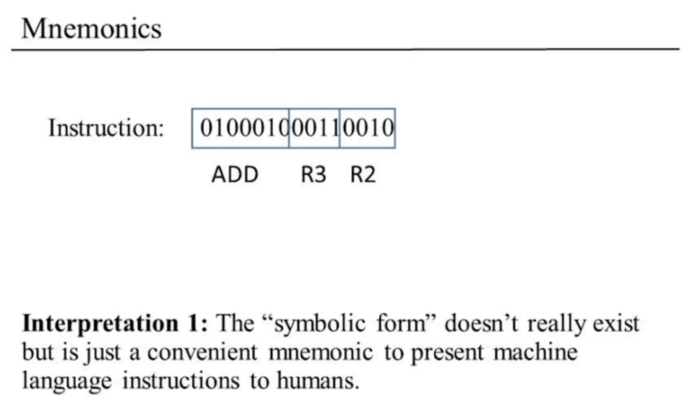
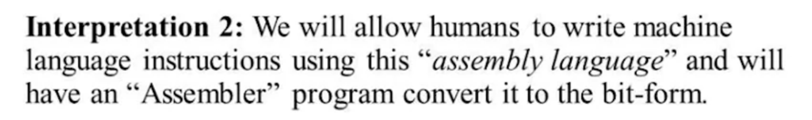
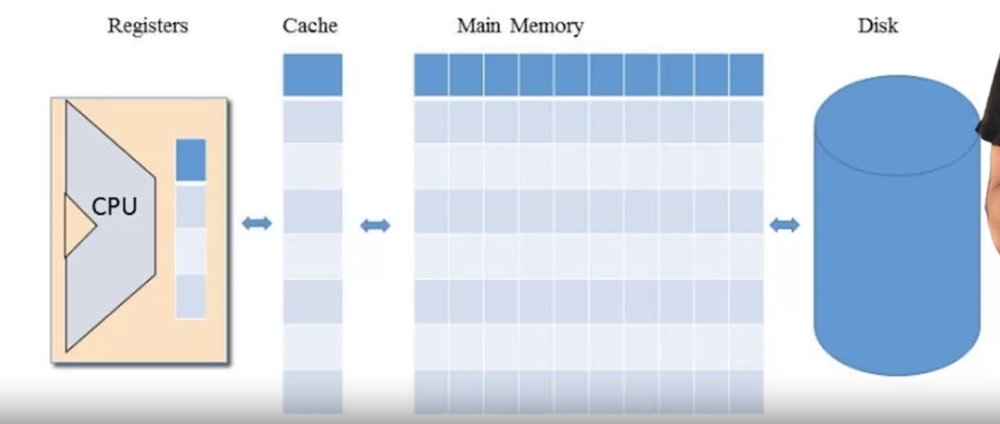
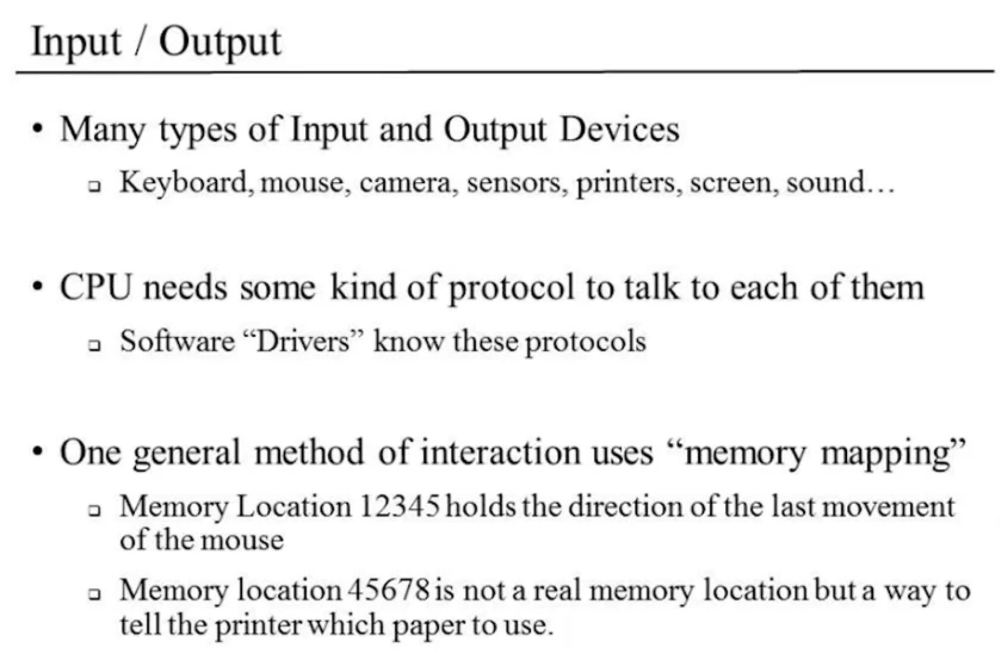
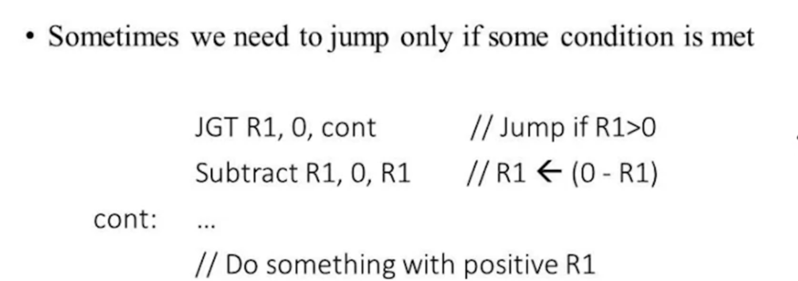
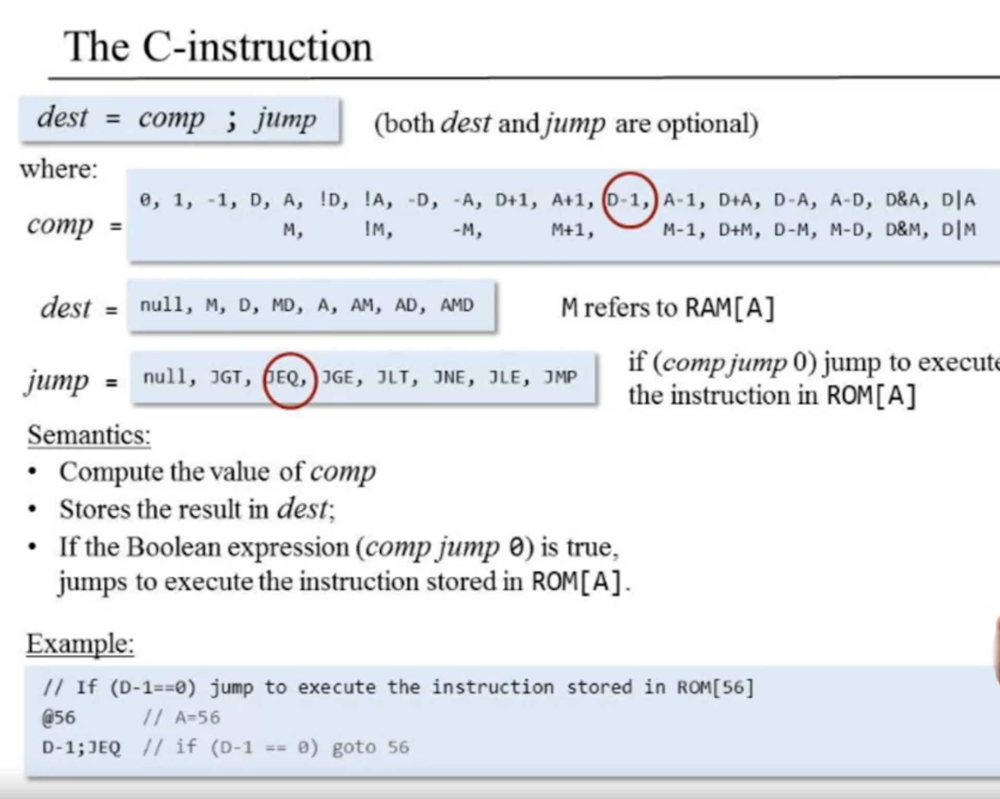
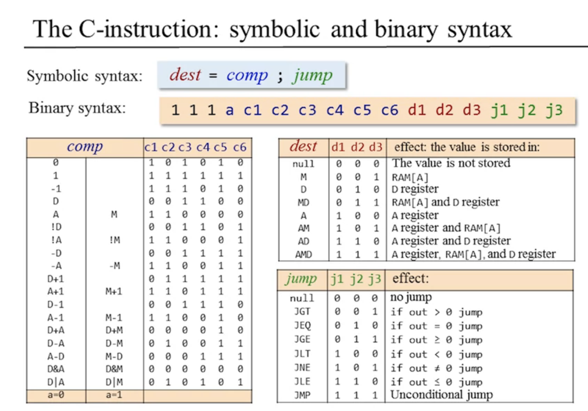
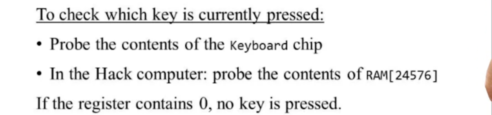

# From Nand To Tetris

## Project4 - Machine Language	

이 장에서는 기계보다는 그 기계를 제어하는 언어에 대하여 중점을 둔다.	

“형태는 기능을 따른다”라는 말처럼 어떠한 시스템을 구축하거나 이해하기 위해선 기능을 먼저 파악해야 한다. 모든 범용 컴퓨터의 궁극적인 기능은 기계어machine language로 작성된 프로그램을 효율적으로 실행하는 것이다. 	

고수준 언어의 목적이 플랫폼 간의 유연성과 강력한 표현력이라면, 기계어의 목적은 대상 하드웨어 플랫폼에서 직접적으로 명령을 실행하고 하드웨어를 제어하는 것이다.

기계어는 프로세서와 레지스터들을 이용하여 메모리를 조작하도록 설계된 언어라고 할 수 있다. 프로세서와 메모리는 별개의 칩으로, 두 칩 사이에서 데이터를 옮기는 것은 상대적으로 느린 작업이다. 따라서 프로세서는 내부에 레지스터들(`R0`, `R1`, `R2`, ...)을 두고 있으며, 이들은 데이터와 명령어를 빠르게 처리하는 고속 로컬 메모리 역할을 한다.

CPU 내에 위치한 레지스터는 두 종류로 나눌 수 있다.

1. data register: 데이터를 저장

2. address register(`A`): 데이터나 주소로 해석되는 값을 저장, 이 값에 해당하는 주소의 메모리를 선택한다. 이처럼 `A` 레지스터가 선택한 주소의 메모리 레지스터를 `M`으로 나타낸다.

   ~~~pseudocode
   // 메모리 위치 17에 값 1를 저장한다
   load A, 17
   load M, 1
   ~~~

   

기계어는 binary와 symbolic 두 가지 버전으로 작성될 수 있다. 기호 기계어를 어셈블리어(assembly language)라고 부르며, 그 언어를 2진 코드로 번역하는 프로그램을 어셈블러(assembler)라고 부른다.

폰노이만 구조? 현대 범용 컴퓨터들이 따르는 모델로, CPU, 메모리, 프로그램 등으로 구성된다.

16비트 컴퓨터라는 말은 CPU와 메모리가 16비트 값들을 처리하고 이동하고 저장하도록 설계되었다는 뜻이다.

---

**Key concepts:** op codes, mnemonics, binary machine language, symbolic machine language, assembly, low-level arithmetic, logical, addressing, branching, and I/O commands, CPU emulation, low-level programming.

---

---

##### Memory Hierarchy

CPU의 처리 속도에 비해 memory에 location에 대한 accessing은 long takes time이 소요된다.

이에 대한 solution으로, CPU에 인접한 registers 및 cache를 두는  memory hierarchy를 따른다.

---

##### Registers - data registers, address registers

---

---

---

---

---

---

