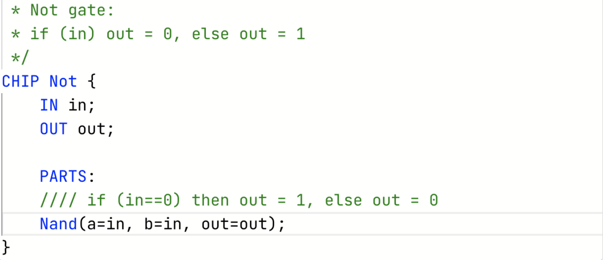
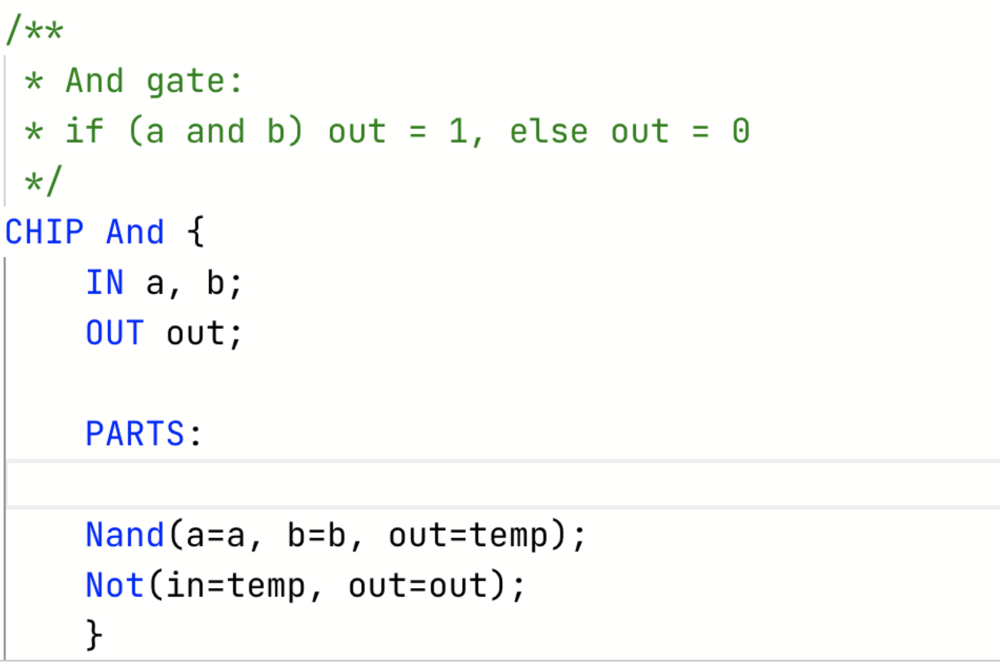
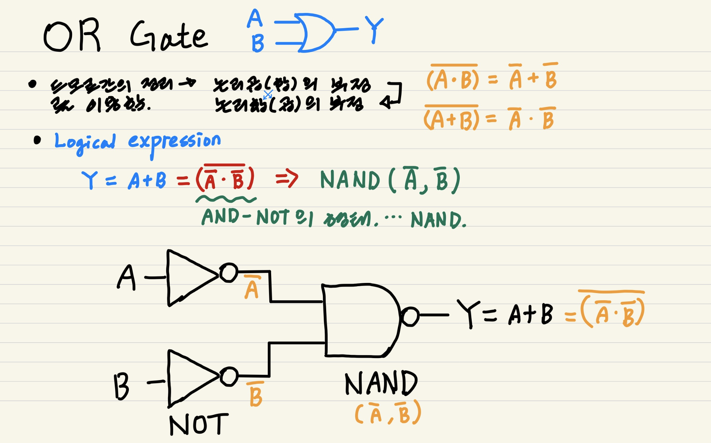
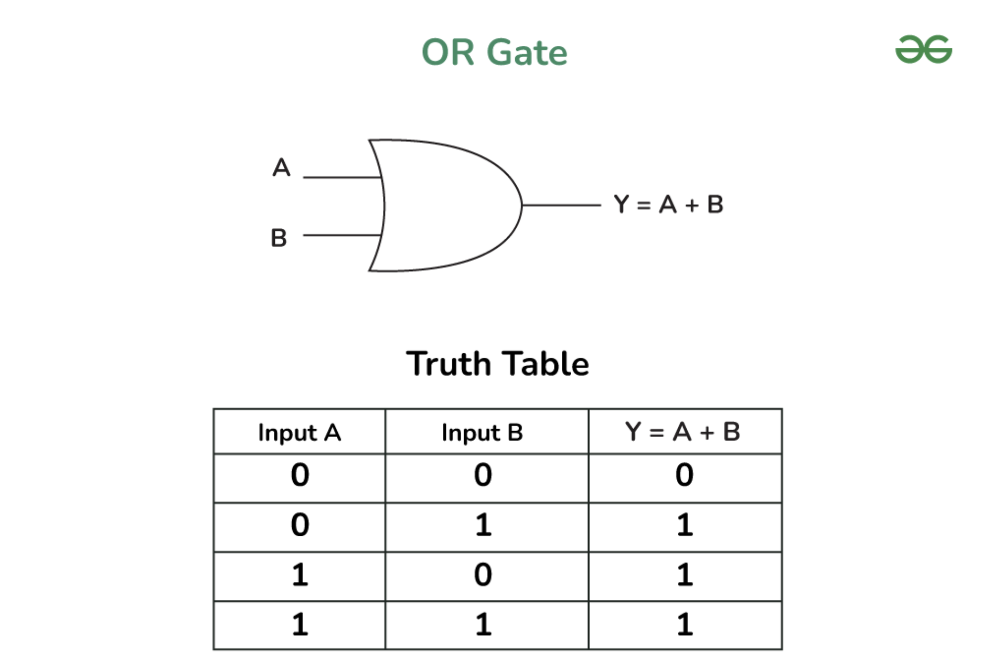
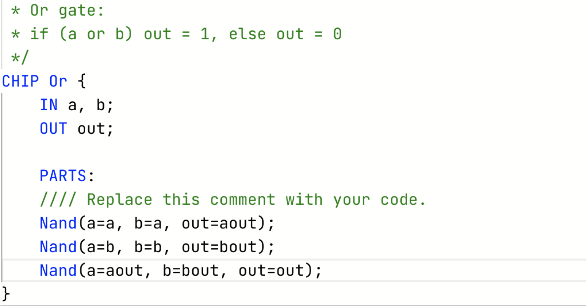
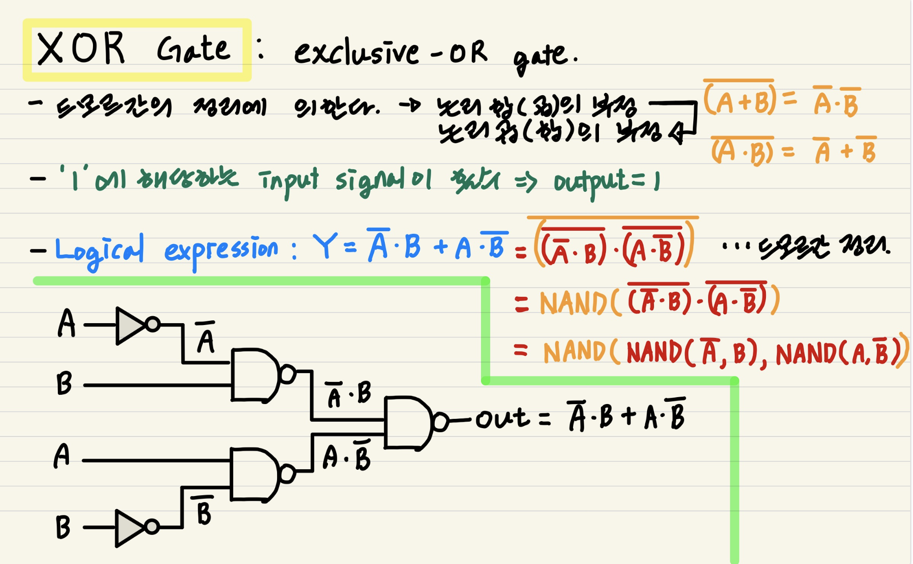
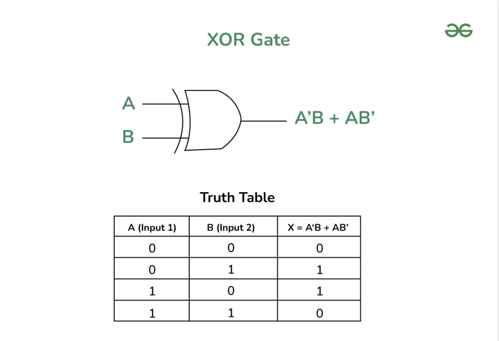
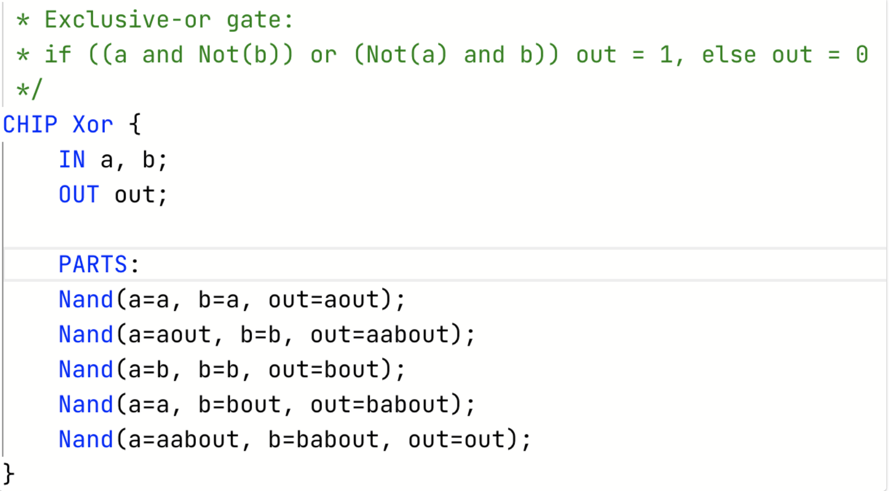

# From Nand To Tetris

## Project1 - Boolean Logic

### 1. Implementation of NOT Gate from NAND Gate

**About Not gate**

- Why? input signal을 reverse한다. Manipulation, Inverter
- What? If the input is 1 (high), the output is 0 (low), and if the input is 0 (low), the output is 1 (high).
  - **Interface of Not Gate** 

- How? 하나의 NAND Gate를 이용하여 구현한다.
  - **HDL of Not Gate**: 

---

### 2. Implementation of AND Gate from NAND Gate

**About And Gate**

- Why? 둘 이상의 input에 대하여 and operation을 수행하기 위함이다.
  - Boolean expression of AND gate: `𝑋.𝑌=𝑍`

- What? 
  - **Interface**

- How? 두 개의 `NOT`(또는 `NAND`) Gate를 이용하여 구현한다.
  - **HDL**

- related: 
  - `NAND` Gate: NAND(A, B)

---

### 3. Implementation of OR Gate from NAND Gate

**About OR Gate**

- Why?

- What?
  - Interface 

- How?
  - HDL 

---

### 4. Implementation of XOR Gate from NAND Gate

**About XOR Gate**

- Why?

- What?
  - Interface 

- How?
  - HDL 

