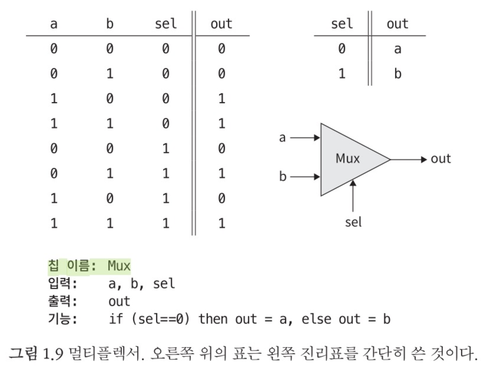
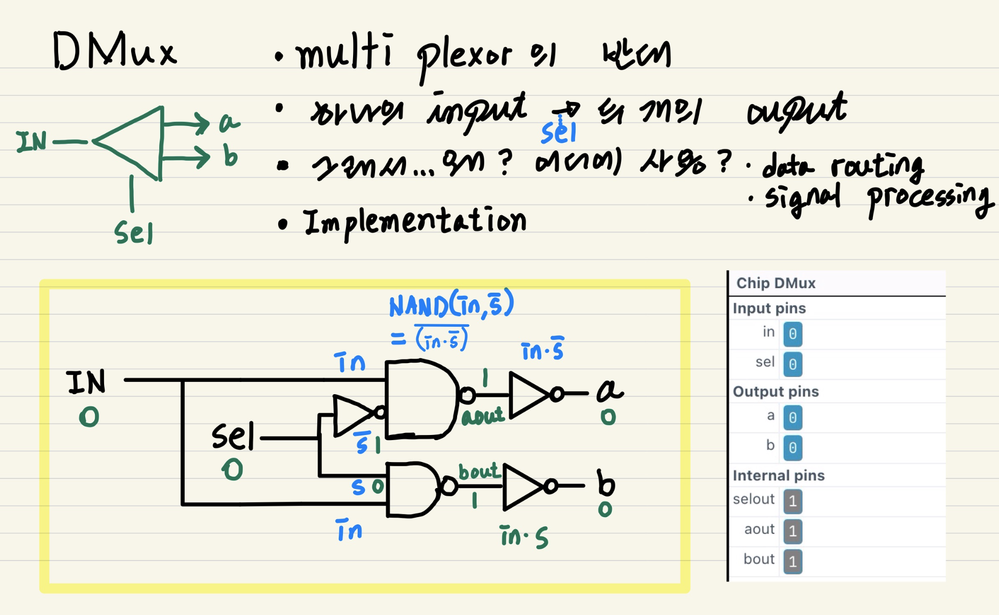
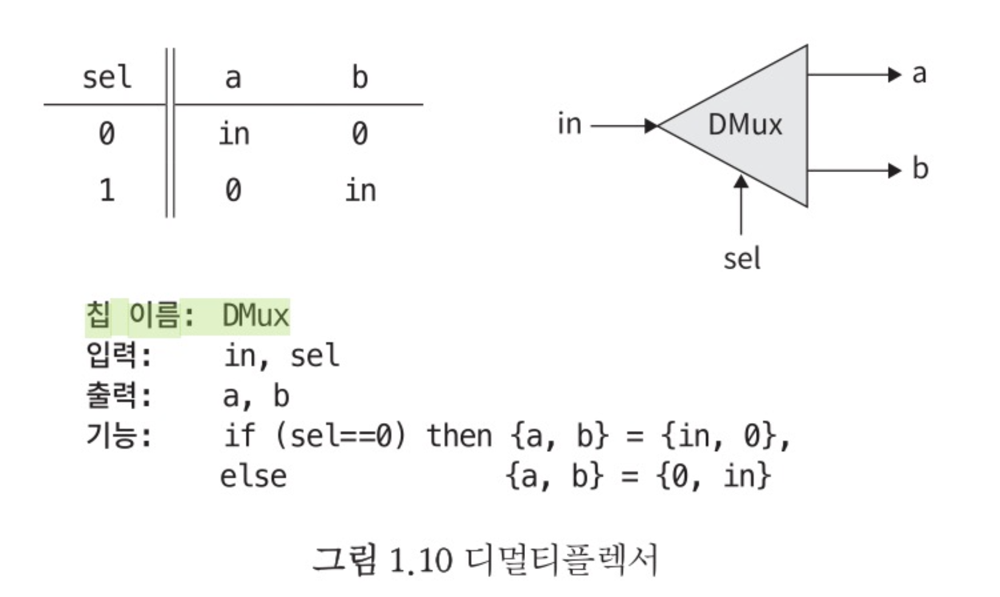
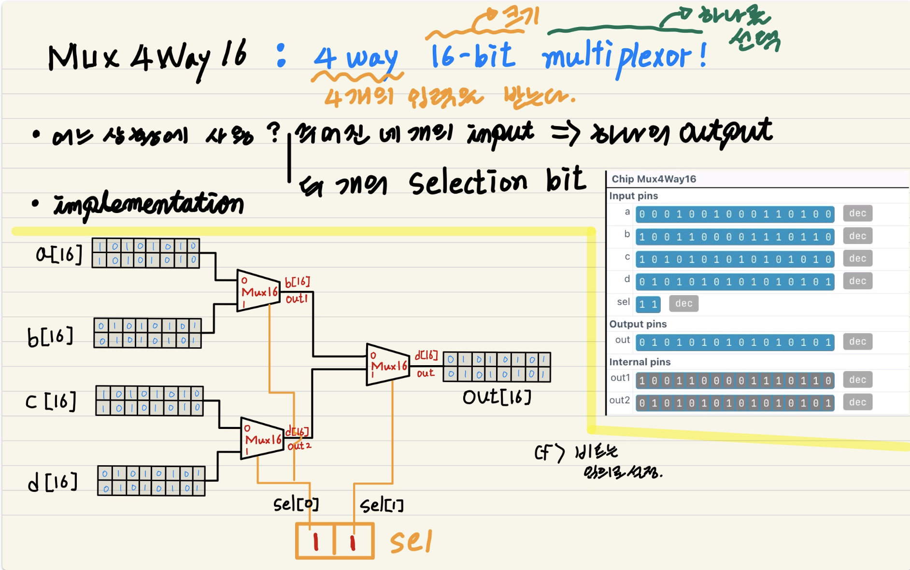

# From Nand To Tetris

## Project1 - Boolean Logic

### 5. Implementation of MUX from NAND Gate

**About MUX Gate**

- Why?

- What?
  - Interface 

- How?
  - HDL 

---

### 6. Implementation of DMUX from NAND Gate

**About DMUX Gate**

- Why?

- What?
  - **Interface** 

- How?
  - **HDL** 

---

### 7. Implementation of Mux4Way16 from NAND Gate

**About Mux4Way16 Gate**

- Why?

- # What?
  
  - **Interface** 
  
- How?
  - **HDL** 

---

### 8. Implementation of Mux8Way16 from NAND Gate

**About And Gate**

- Why?

- What?

- How?
  - HDL 

### 9. Implementation of DMUX4Way from NAND Gate

**About And Gate**

- Why?

- What?

- How?

**HDL of And Gate**

### 10. Implementation of DMUX8Way from NAND Gate

**About And Gate**

- Why?

- What?

- How?

**HDL of And Gate**

### 11. Implementation of Or8Way from NAND Gate

**About And Gate**

- Why?

- What?

- How?

**HDL of And Gate**

### 12. Implementation of NOT16 from NAND Gate

**About And Gate**

- Why?

- What?

- How?

**HDL of And Gate**

### 13. Implementation of AND16 from NAND Gate

**About And Gate**

- Why?

- What?

- How?

**HDL of And Gate**

### 14. Implementation of OR16 from NAND Gate

**About And Gate**

- Why?

- What?

- How?

**HDL of And Gate**

### 15. Implementation of MUX16 from NAND Gate

**About And Gate**

- Why?

- What?

- How?

## 